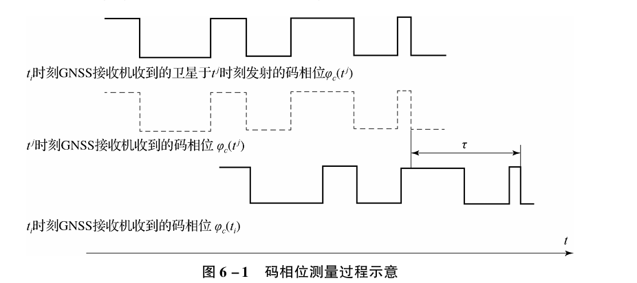
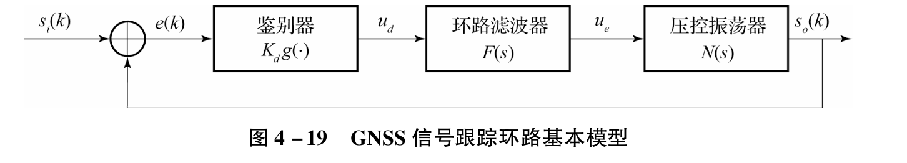
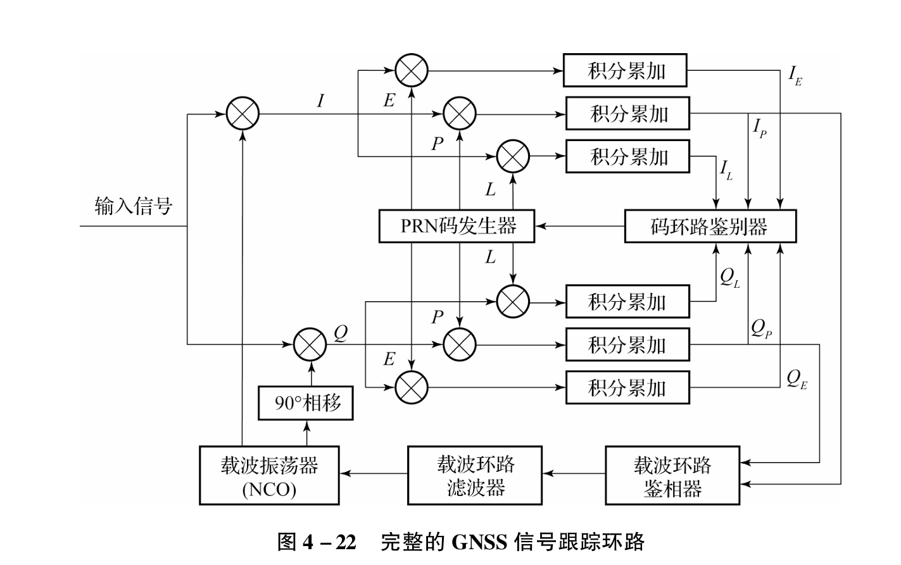
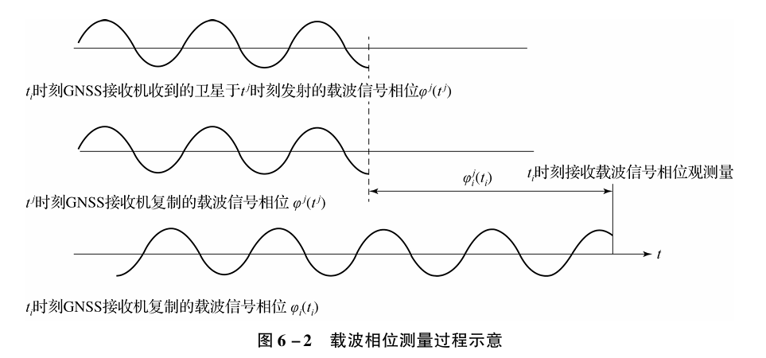
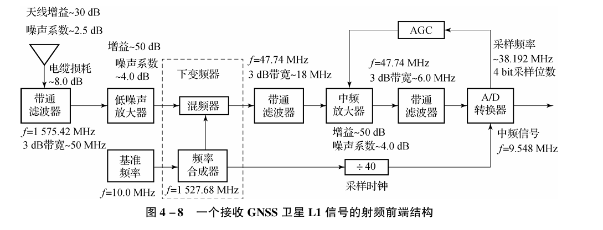
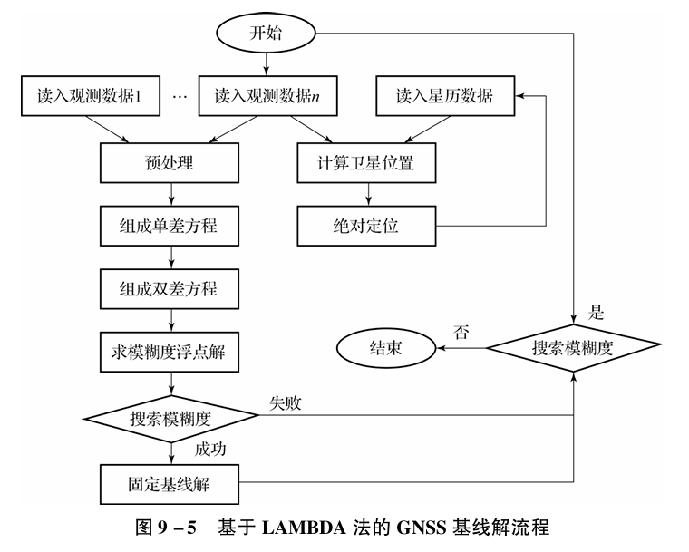

# GNSS题库
## 一、填空题
### 1. GNSS 的 SA 政策是指什么？A-S 政策是指什么？
- p8
- 实施选择可用性（SＡ）政策。在GPS计划试验阶段，利用C/A码定位的精度远远高于设计精度， 甚至可达到14ｍ， 于是美国政府采取了SA政策，人为地将误差引入卫星时钟和卫星星历数据，故意降低SPS的定位精度，以防止未经特许的用户将GPS用于军事目的。美国政府已宣布，自2000年5月1日子夜开始，取消SA政策，使民用C/A码的定位
精度大大提高。
- P码加密措施。P码加密措施，也称为 “反电子欺骗”（Ａ－Ｓ）措施。在某些特殊
情况下，比如战时或泄密的情况下，如果有人知道了特许用户GPS接收机所接受卫星的频率和相位，从而发射适当频率的干扰信号，这一欺骗电子信号可诱使特许用户GPS接收机
错锁信号， 产生错误的定位导航信息。 美国政府为了防止这种电子欺骗采取了A-S措施，这是一种必要时对P码进一步加密的措施。
### 2. 实现 GNSS 定位需要几颗可见卫星？故障检测至少需要几颗？故障识别需要几颗？
- p272-276
- 实现 GNSS 定位：至少需要 4 颗 可见卫星（用于解算三维位置和时间）；
- 故障检测：通常需要至少 5 颗 卫星；
- 故障识别：通常需要至少 6 颗 卫星。
- ai给出说在p12增强整体性。由于有了更多可视卫星，导航者在进行自主式侦测时，可以较容易地侦测与分辨异常现象，增强了整体性。
### 3. GNSS 定位中的卫星钟改正参数从载波、测距码还是导航电文中获取？
导航电文获取p63
### 4. 不同测站同步观测相同卫星的观测量单差可消除什么影响？
📘 答案出处：《卫星导航定位ZW》第 175页（第7章 GNSS静态定位）
- 答案：站际单差主要消除卫星钟差影响，同时部分削弱轨道误差与大气延迟误差。
📖 页码：约 第175页
### 5. 不同测站同步观测同组卫星的双差可消除什么影响？
📘答案出处：《卫星导航定位ZW》第 175–176页（第7章）
- 答案：站际、星际双差可同时消除卫星钟差与接收机钟差的影响，并减弱电离层与对流层折射误差即大气延迟的影响明显减弱。
📖 页码：约 第175–176页
### 6. 站际单/双差、星际单/双差、历元际单/双差，主要消除哪些因素？
📘 答案出处：《卫星导航定位ZW》第 170–176页（第7章）p170
- 站际单差：**消除卫星钟差**，明显减弱大气延迟的影响。（不同观测站观测同一卫星）
- 星际单差：**消除接收机钟差**，不能减弱星钟误差（同一观测站观测不同卫星）
- 历元单差：**消除整周模糊度**，大气折射的影响的残差可以略去。（不同时间同一卫星同一观测站）
- 站际、星际双差：**进一步消除GNSS接收机钟差的影响**。
- 星际、历元间双差：**消除了GNSS接收机钟差和整周模糊度**
- 站际、历元间双差：**消除了电离层及对流层折射的影响**，也会减小钟差的影响
📖 页码：第 170–176页
### 7. L1 信号属于载波、伪随机还是捕或码？
📘 答案出处：《卫星导航定位ZW》第50页（第3章 GNSS卫星信号）
- L1 信号 属于 载波信号，是GNSS卫星发射的主载波之一（L1=1572.42 MHz）。
📖 页码：第50页
### 8. 轨道六要素的含义、作用；

📘 答案出处：《卫星导航定位ZW》第 42–43页（第2章2.5.2节）
| 参数 | 含义 |
| :---: | :--- |
| $\Omega$ | 升交点赤经，为天球赤道面上升交点$N$与春分点$\Gamma$的地心夹角 |
| $i$ | 轨道面倾角，为轨道平面与地球赤道面之间的夹角 |
| $a$ | 卫星轨道椭圆的长半轴，决定轨道大小 |
| $e$ | 卫星轨道椭圆的偏心率，决定轨道形状 |
| $\omega$ | 近地点角距，为卫星轨道椭圆的近地点$P$相对于升交点$N$的地心夹角 |
| $f$ | 真近点角，为运行于椭圆轨道上的卫星$S$相对于近地点$P$的地心角距 |

📖 页码：第 42–43页
### 9. 双频接收机可以同时接收 L1 和 L2 信号，利用双频技术可以消除或减弱什么对观测量的影响？
📘 答案出处：《卫星导航定位ZW》第 154–155页（第6章6.4.3节）
- 利用L1、L2双频观测可以消除电离层折射影响，使传播路径延迟误差降至厘米级。
📖 页码：第 154–155页
### 10. 消除电离层影响的措施是什么？
📘 答案出处：《卫星导航定位ZW》第 154–155页（第6章6.4.3节）
- 1. 利用双频观测修正（最有效）。
- 2. 利用电离层模型修正（单频接收机常用）。
- 3. 利用同步观测值求差。
📖 页码：第 154–155页
### 11. VDOP、HDOP、GDOP、TDOP 名称及含义？
📘 答案出处：《卫星导航定位ZW》第168页
- (1) 平面位置精度因子（HDOP），其定义及相应的平面位置精度 \( m_H \) 分别为
\[ HDOP = (g_{11} + g_{22})^{1/2}, \quad m_H = \sigma_0 \cdot HDOP  \]

- (2) 高度精度因子（VDOP），其定义及相应的高度精度 \( m_V \) 分别为
\[ VDOP = (g_{33})^{1/2}, \quad m_V = \sigma_0 \cdot VDOP  \]

- (3) 空间（三维）位置精度因子（PDOP），其定义及相应的空间位置精度 \( m_p \) 分别为
\[ PDOP = (q_{11} + q_{22} + q_{33})^{1/2}, \quad m_p = \sigma_0 \cdot PDOP  \]

- (4) GNSS 接收机钟差精度因子（TDOP），其定义及相应的钟差精度 \( m_T \) 为
\[ TDOP = (q_{44})^{1/2}, \quad m_T = \sigma_0 \cdot TDOP  \]

- (5) 几何精度因子（GDOP），其定义及相应的几何精度 \( m_G \) 为
\[ GDOP = (q_{11} + q_{22} + q_{33} + q_{44})^{1/2} = [(PDOP)^2 + (TDOP)^2]^{1/2},
\]\[ m_G = \sigma_0 \cdot GDOP  \]

📖 页码：第168页。
### 12. 假设测站与观测卫星所构成的空间立体体积为 V，几何精度因子 GDOP 与 V 的关系？
📘 答案出处：《卫星导航定位ZW》第169页
- GDOP 与被观测卫星所构成的四面体的体积V成反比，随着四面体体积越大，GDOP 越小。
📖 页码：第 130页。
### 13. 载波、C/A 码 、P 码、数据码含义，星历数据位于哪里？
📘 答案出处：《卫星导航定位ZW》第50页
- **载波：**载波是未受调制的周期性振荡信号，它可以是正弦波，也可以是非正弦波（如周期性脉冲信号）。 载波调制就是用调制信号去控制载波参数的过程，载波调制后的信号称为已调信号。如GPS含有两个载波信号L1和L2，频率分别为1572。42MHZ和1277.60MHZ（p50）。
- **C/A码：**用于C/A码码用于分址、搜捕卫星信号和粗测距，它是具有一定抗干扰能力的明码，主要用于民用。 
- P码：高精度伪随机码，军用。（p61）
- 数据码（导航电文）：数据码（$D(t)$，或称导航电文编码），导航电文是指包含导航信息的数据码$D(t)$。导航信息包括卫星星历、卫星工作状态、卫星历书、时间系统、星钟改正参数、轨道摄动改正参数、大气折射改正参数、 遥测码以及由C/A码确定P(Y)码的交换码等，是用户利用GPS进行导航定位的数据基础。（p62）
- 星历数据位于导航电文中。（p145）

### 14. UTC 表示什么？
📘 答案出处：《卫星导航定位ZW》第 38–39页（第2章2.3节）
- UTC（协调世界时）：由原子时（TAI）和世界时（UT1）加闰秒协调而成的时间系统，是GNSS时间换算基准。
📖 页码：第 38–39页。
### 15. 白天的电离层误差影响比晚上的影响大还是小？
📘 答案出处：《卫星导航定位ZW》第 154页（第6章6.4.3节）
- 白天（尤其正午）电离层电子密度高，影响大；夜间电子密度低，影响小。
对于GNSS卫星信号来说，白天正午前后，当卫星接近地平线时，电离层折射的影响可能超过150m； 在夜间，当卫星处于天顶方向时，电离层折射的影响将小于5m。
📖 页码：第 154页
### 16. 精密定位服务、标准定位服务、选择可用性、反电子欺骗含义
📘 出处：第1章 §1.2.4（第8–9页）
- 精密定位服务（PPS）：利用P码，定位精度约10 m，仅限军方或授权用户。
- 标准定位服务（SPS）：利用C/A码，定位精度约100 m，面向民用。
- 选择可用性（SA）：人为引入卫星钟与星历误差以降低民用精度，以防止未经特许的用户将GPS用于军事目的，2000年起取消。
- 反电子欺骗（A-S）：必要时对Ｐ码进一步加密的措施。
📖 页码：第 8–9 页
### 17. 原子时、UTC、GPST、世界时含义及关系
📘 出处：第2章 §2.4.2–§2.4.5（第38–40 页）
- 原子时（AT）：原子时的秒长定义为：位于海平面上的铯133原子基态２个超精细能级，在零磁场中跃迁辐射振荡9192631770周所持续的时间，为１原子时秒。 
- UTC（协调世界时）：由原子时（TAI）和世界时（UT1）加闰秒协调而成的时间系统，是GNSS时间换算基准。
- GPST（GPS时）：以1980 年1月6日0时UTC为原点，不加闰秒，与1AT相差19s。GPST属于原子时系统， 采用1AT秒长作为时间基准， 但时间起算的原点定义在1980年1月6日0时的UTC。启动后不跳秒，保持时间的连续，以后随着时间的积累，GPST与UTC的差别增大，2003年上半年相差13s。GPST与1AT在任一瞬时均有19s的常量偏差。
- 世界时（UT）：世界时是以地球上零经度子午圈（格林尼治子午圈）所对应的平太阳时，且以平子夜为零时起算的时间参考系统。 
📖 页码：第 38–40 页
### 18. P 码属于载波信号、伪随机噪声码、随机噪声码还是捕获码？
📘 出处：第4章 §4.2（第90–91 页）
- P码为伪随机噪声码（PRN码），用于精密测距。
📖 页码：第 90–91 页
### 19. 码相位观测的误差比载波相位观测误差大小？
📘 出处：第6章 §6.1.3–§6.1.4（第139–141 页）
- 码相位观测（测码伪距）误差：C/A码2.9m，P码0.29m，米级
- 载波相位观测（测相伪距）误差：约为毫米级，L1 0.19cm，L2 0.24cm，精度高几个数量级。
📖 页码：第 139–141 页
### 20. 单差、双差、三差含义
📘 出处：第7章 §7.2（第170–172 页）
- 单差：不同GNSS接收机之间、不同卫星之间、不同历元之间的相位观测量的一次差，简称单差。
- 双差：对站际单差、 关于不同卫星再求二次差， 称为站际星际双差。对星际单差、 关于不同历元再求二次差， 称为星际历元双差。对站际单差、 关于不同历元再求二次差， 称为站际历元双差。
- 三差： 于不同的历元同步观测同一组卫星，所得的双差的差值简称三次差。
📖 页码：第 170–172 页

--- 

### 1. 计量原子时的时钟称为原子钟，常用的有铯原子钟、 铷原子钟和氢原子钟等，国际上采用哪种
📘 出处：第2章 §2.4.2（第38 页）
- 常用：铯原子钟、铷原子钟、氢原子钟。
- 国际采用：铯原子钟。
📖 页码：第 38 页
### 2. C/A 码、粗码、捕获码关系
📘 出处：第6章 §6.1.2（第139 页）
- C/A码即粗码，用于民用与捕获,同时是捕获码（p61）；P码称精码。
📖 页码：第 139 页
### 3. 测码伪距测量所使用的测距信号是什么
📘 出处：第6章 §6.1.2（第139 页）
- 使用C/A码或P码测距信号。
📖 页码：第 139 页
### 4. 岁差、章动运动特点
📘 出处：第2章 §2.2（第29页）
- 岁差：是指在日、月行星引力的共同作用下，地球自转轴在空间的方向发生周期性变化。
- 章动：岁差基础上的周期性短期摆动。如果将任一观测时刻的北天极的实际位置称为瞬时北天极（也称为真北天极），而与之相应的天球赤道和春分点称为瞬时真天球赤道和瞬时真春分点（亦称为真天球赤道和真春分点），瞬时北天极绕瞬时平北天极产生旋转，大致呈椭圆形轨迹， 其长半径约为9.2″，周期约为18.6年，这种运动称为章动。
📖 页码：第29页
### 5. 随机码、伪随机码特点
📘 出处：第4章（第51页）
- 随机码
（１）随机码为非周期性码，不存在任何编码规则，因此不能被复制。
（２）随机码中 “０” 和 “１” 出现的概率均为1/2。
（３）随机码$u(t)$的自相关函数$R(\tau)$具有如下性质
$$
\begin{cases} 
R\left( \tau \right) = 1, & \tau = 0 \\ 
R\left( \tau \right) = 0, & |\tau| > t_0 \\ 
R\left( \tau \right) = 1 - \frac{\tau}{|t_0|}, & -t_0 < \tau < t_0 
\end{cases}
$$
- 伪随机码具有良好的自相关特性，又有周期性，可复制。
📖 页码：第 51 页
### 5. GDOP 含义，其大小与定位精度关系、
📘 出处：第5章 §5.3（第168–170 页）
- **GDOP（几何精度因子）**反映卫星几何分布对定位精度的影响；GDOP越小，定位精度越高。
- **几何精度因子（GDOP）**，其定义及相应的几何精度 \( m_G \) 为
\[ GDOP = (q_{11} + q_{22} + q_{33} + q_{44})^{1/2} = [(PDOP)^2 + (TDOP)^2]^{1/2},
\]\[ m_G = \sigma_0 \cdot GDOP  \]
📖 页码：第 168–170 页。
### 6. 定位精度、GDOP、卫星数目关系
📘 出处：同上
- 当GNSS接收机$T_i$到各观测卫星连线的张角都较大时，GDOP值较小。在观测卫星为４ 颗时，处于GNSS接收机$T_i$上空的４ 颗卫星形成的四面体的体积最大时，GDOP最小。
📖 页码：第 168–170 页。
### 7. 测相伪距观测误差方程、测码伪距观测误差方程特点
📘 出处：第6章 §6.1（第165页）
- 测码伪距误差方程
\[\textbf{V}_i=\textbf{A}_i\delta\textbf{T}_i+\textbf{L}_i\]

    特点：
    - 观测值为卫星发射的码信号传播时间换算的距离。
    - 精度较低（米级），受噪声、多路径、大气影响大。
    - 无整周模糊度项，可单历元直接解算位置和钟差。
    - 适用于 **单点定位（绝对定位）** 和一般导航。
- 测相伪距误差方程
\[\textbf{V}_i=\textbf{A}_i\delta\textbf{T}_i+\textbf{B}_i\delta\rho_i+\textbf{E}_i\textbf{N}_i+\textbf{L}_i\]

    特点：
    - 观测值为载波相位（波长级），精度极高（毫米—厘米级）。
    - 含有整周模糊度$\textbf{N}_i$，不能单历元独立求解。
    - 需通过多历元或差分方式消除公共误差并定解模糊度。
    - 适用于相对定位、高精度静态或动态定位（RTK）。

测码伪距——噪声大但直接可解，用于普通导航；
测相伪距——精度高但含模糊度，用于高精度定位。
📖 页码：第 184-185 页
### 8. C/A 码的码长、码元特点，是否易于捕获，测距精度特点
📘 出处：第4章（第60 页）
- 码长 = 1023 bits，重复周期 = 1 ms,周期为Ｔ＝1ms，码率为1.023MHz，码长短，易捕获，码元1023个，码元宽度较大，测距误差为2.93～29.3ｍ，由于精度较低，故C/A码也称为粗码。
📖 页码：第 60 页
### 9. 码相位测量的测距精度、载波相位测量的测距精度比较
📘 出处：第6章 §6.1.3（第140 页）
- 载波相位测距精度 ≫ 码相位测距精度（约高3–4个数量级）。
📖 页码：第 140 页
### 10. 卫星瞬时位置、真近点角、平近点角、卫星运行平均角速度关系
📘 出处：第2章 §2.5.1（第42–43 页）
- 三者由开普勒方程联系：
$f$为真近点角,$M$为平近点角，$n$为卫星运行平均角速度，$e$卫星轨道椭圆的偏心率,$a$卫星轨道椭圆的长半轴
\[
\begin{bmatrix} x_s \\ y_s \\ z_s \end{bmatrix} = r \begin{bmatrix} \cos f \\ \sin f \\ 0 \end{bmatrix} = a \begin{bmatrix} (\cos E - e) \\ \sqrt{1 - e^2} \sin E \\ 0 \end{bmatrix}
\]\[
    tan\frac{f}{2}=\frac{\sqrt{1+e}}{\sqrt{1-e}}tan\frac{E}{2}    
\]\[
    M=n(t-t_0)    
\]\[
    E=M+esinE    
\]
📖 页码：第 42–43 页。
### 11. WGS－84 坐标系、协议地球坐标系关系
📘 出处：第2章 §2.6（第34 页）
- WGS-84是协议地球坐标系（ECEF）的实现形式之一。
WGS-84的全称是世界大地坐标系－84，它是协议地球坐标系的一个实现，属于ECEF坐标系。 
📖 页码：第 34 页。
### 12. 随机码、伪随机码的可复制性
出处：第4章（第51页）
- 随机码不可复制；
- 伪随机码可按确定算法复制。
📖 页码：第51页
### 13. 测码伪、载波关系
📘 出处：第6章 §6.1（第139–141 页）
- 测码伪距：由码信号相位确定；
- 载波相位测距：由载波相位差确定。

测码伪距观测量和测相伪距观测量， 它们分别是对ＧＮＳＳ信号的码相位和载波相位进行观测所得的观测量。
📖 页码：第 139–141 页

---

### 1. 码相关系数的公式是$R(\tau)=\frac{A-D}{A+D}$请用此公式来简要说明利用 C/A码来测量 GNSS卫星到 GNSS 接收机的距离的基本原理，用简图加以说明？
【答案详解】
为了测量码信号的时间延迟，在GNSS接收机中复制了与卫星发射的测距码C/A结构完全相同的码信号，通过对GNSS接收机中复制的测距码进行相移，使其在码元上与接收到的卫星发射的测距码对齐，即进行相关处理。当相关系数$R$为1时，接收到的卫星测距码与本地复制的测距码码元对齐。此时的相移量就是卫星发射的码信号到达GNSS接收机的传播时间$\tau$，即时间延迟。
图6-1所示为码相位测量过程示意，其中$t^j$为卫星$S^j$发射信号时的卫星星钟的刻；$t_i$为GNSS接收机$T_i$ 接收到$t^j$时刻卫星发射的码相位的站钟时刻；$\varphi _c(t_j)$为卫星星钟在$t^j$时刻发射的码相位；$\varphi _c(t_j)$为GNSS接收机在站钟$t_i$时刻接收到的码相位。

在卫星星钟和GNSS接收机站钟完全同步的情况下，如果忽略大气对无线电信号的影响，所得到的时间延迟量$\tau$与传播速度（即光速$c$）相乘，即卫星与GNSS接收机之间的几何距离（或称真距离）：
$$ R_i^j = c\tau$$

【参考页码】
第 138–139 页（第6章 §6.1.1）

### 2. 简述测码伪距观测量。
测码伪距观测量指的是，测量GNSS卫星发射的测距码信号（如C/A码或Ｐ码）到达GNSS接收机的电波传播时间，与电波传播速度相乘得到卫星与用户的几何距离。因此，测码伪距观测量也称为时间延迟观测量。

【参考页码】
第 138–139 页（第6章 §6.1.1）
### 3. 简述 GNSS 信号的主要捕获方法、跟踪环路？画出 GNSS 跟踪总体架构？
【答案详解】
- 1. 连续捕获方法
连续捕获方法是在码相位和载波多普勒频率所构成的二维空间上进行的，先进行码相位搜索，再对多普勒频带进行搜索。采用串行顺序搜索的方式，以小于一个码片为步进量，从零多普勒开始逐步搜索全部码相位，如不能捕获则跳到下一个多普勒频带继续码相位搜索。
- 2. 并行捕获方法
连续捕获方法是采用串行的方式，对所有可能的码相位和频率进行二维搜索，因此比较耗时。如果在搜索过程中消除一个参数，采用并行的方式则可以节省捕获时间。基于该思路，可以得到并行频率捕获方法和并行码相位捕获方法。

GNSS信号跟踪环路通常包含鉴别器、环路滤波器以及压控振荡器三个主要部分，基本模型如下图所示，它给出了环路误差控制量的反馈关系。鉴别器将比较$k$时刻的输入信号$s_i(k)$与压控振荡器（VCO）的输出信号$s_o(k)$，然后输出一个随误差$e(k)$变化的误差电压$u_d$，再经过环路滤波器平滑后送到压控振荡器中使误差减小，最后使$s_o(k)$与$s_i(k)$之间的误差控制量越来越小。

【参考页码】
第 99-103 页（第4章 §4.3）
### 4. 简述 GNSS 导航定位的观测量？测码伪距观测方程、测相伪距观测方程？
【答案详解】
GNSS的观测量，是用户利用GNSS接收机（观测站）观测GNSS卫星发射的信号而获得的导航定位信息，是用户进行导航定位的重要依据。GNSS卫星到用户的观测距离，由于受到各种误差源的影响，与卫星到用户的真实几何距离并非完全一致，而是含有误差，这种带有误差的GNSS观测距离称为伪距。由于GNSS卫星信号含有多种定位信息，根据导航定位的不同要求和方法，可以获得不同的观测量:测码伪距观测量；测相伪距观测量；多普勒频移观测量；干涉法测量时间延迟。目前，在GNSS导航定位中广泛采用的观测量为前两种，即测码伪距观测量和测相伪距观测量，它们分别是对GNSS信号的码相位和载波相位进行观测所得的观测量。多普勒频移观测量可以采用多普勒积分计数法得到，它所需要的观测时间为数小时，多应用于诸如大地测量之中的静态定位。干涉法测量时间延迟所需的设备相当昂贵，数据处理也比较复杂，其广泛应用尚待进一步的研究开发。
- 测码伪距观测方程
$$
\rho_i^j(t) = R_i^j(t) + c\delta t_i(t) + \Delta^j_{i,I}(t) + \Delta ^j_{i,T}(t) 
$$其中$\delta t_i(t)$为于观测历元$t$时刻，GNSS接收机站钟的钟差；$\Delta^j_{i,I}(t)$和$\Delta ^j_{i,T}(t)$分别为于观测历元$t$时，电离层折射和大气对流层折射对测码伪距的影响。
- 测相伪距观测方程
$$
\Phi_i^j(t) = \frac{f}{c} R_i^j(t) + f [\delta t_i(t) - \delta t^j(t)] - N_i^j(t_0) + \frac{f}{c} [\Delta_{i,I}^j(t) + \Delta_{i,T}^j(t)]
$$

$$
\lambda \Phi_i^j(t) = R_i^j(t) + c [\delta t_i(t) - \delta t^j(t)] - \lambda N_i^j(t_0) + \Delta_{i,I}^j(t) + \Delta_{i,T}^j(t) 
$$

测码伪距主要用于快速定位，载波相位用于高精度定位。
【参考页码】
第 139–141 页（第6章 §6.1）
### 5. 简述测相伪距观测量含义，并用简图加以说明？
【答案详解】
测相伪距观测量指的是，卫星星钟在$t^j$时刻发射的载波信号，与GNSS接收机站钟在$t_i$时刻复制的载波信号的相位差，与载波信号的波长相乘得到的伪距。因此，测相伪距观测量也称为载波相位观测量。
由于卫星载波信号上调制有二进制测距码和数据码，为了进行载波相位测量，必须首先去掉调制信号，恢复载波信号。这可以由信号捕获和跟踪环路进行载波测量，或采用平方解调等技术来恢复载波信号。
下图所示为载波相位测量过程示意，其中$\varphi^j(t^j)$为卫星$S^j$在$t^j$时刻的载波信号相位；$\varphi_i(t_i)$为GNSS接收机$T_i$在$t_i$ 时刻的复制信号相位，则载波信号的相位差为
\[\varphi_i^j=[\varphi_i(t_i)-\varphi^j(t^j)]\lambda\]
假设GNSS接收机内振荡器频率初相与卫星发射载波初相完全相同，两者振荡频率也完全一致并稳定不变，并假设星钟和站钟也完全同步。记载波信号的波长为λ，则由卫星到GNSS接收机的几何距离为
\[
    R_i^j=\lambda \varphi_i^j=[\varphi_i(t_i)-\varphi^j(t^j)]\lambda  
\]

【参考页码】
第 140 页（第6章 §6.1.3）

### 6. 简述测相伪距描述的卫星到接收机的距离？
【答案详解】
测相伪距通过载波波长与相位差表示传播距离：
\[
    R_i^j=\lambda \varphi_i^j=[\varphi_i(t_i)-\varphi^j(t^j)]\lambda  
\]
其中 $\lambda$为载波波长，$\varphi^j(t^j)$为卫星$S^j$在$t^j$时刻的载波信号相位；$\varphi_i(t_i)$为GNSS接收机$T_i$在$t_i$ 时刻的复制信号相位，则载波信号的相位差为$\varphi_i^j=[\varphi_i(t_i)-\varphi^j(t^j)]\lambda$
【参考页码】
第 140–141 页（第6章 §6.1.3）
### 7. 关于 GNSS 观测量的误差有哪几类？并分类简要说明之。
【答案详解】
- 1. 与GNSS卫星有关的误差:星历误差与模型误差、钟差与稳定性、卫星摄动、相位不确定、其他
- 2. 与GNSS信号传播有关的误差；电离层折射、对流层折射、多路径效应、其他
- 3. 与GNSS接收机有关的误差：接收机噪声、其他

若根据误差的性质，上述误差又可分为系统误差与偶然误差。系统误差指星历误差、星钟钟差、站钟钟差以及大气电离层与对流层折射误差。观测误差和多路径效应误差称为偶然误差。
【参考页码】
第 151 页（第6章 §6.4）
### 8. 简述 GNSS 系统的性能评价指标，以及主要的 GNSS 完好性监测方法。
【答案详解】
GNSS 性能主要通过四个指标评价：
- **精度**：指的是GNSS为载体所提供的位置和载体当时真实位置的重合度；
- **完好性**：指的是GNSS在使用过程中，发生故障或性能变坏所导致的误差超过可能接受的限定值（告警限值）时，为用户提供及时、有效告警信息的能力。
- **可用性**：指的是GNSS能为载体提供可用的导航服务的时间所占的百分比。
- **连续性**：指的是GNSS在给定的使用条件下及规定的时间内，维持规定性能的概率。 

完好性监测方法:
-  **内部完好性检测**：指的是依靠载体使用的GNSS接收机来实现完好性监测。
- **外部完好性监测**：指的是在ＧＮＳＳ之外，利用外部的地基或空基监测系统进行完好性监测。 
【参考页码】
第 266–267 页（第11章 §11.1–11.2）
### 9. 简述差分方式的分类，并分析某一种差分 GNSS 定位可提高测量精度的道理。
【答案详解】
差分类别：
- 单差
- 双差
- 三次差

提高精度的原理：
- 站际单差：
站际单差是GNSS接收机$T_1$和$T_2$同时观测卫星$S^j$，将2个GNSS接收机的相位观测方程代入单差表达式的第一式，可得
$$
\begin{aligned}
\Delta \varphi^j(t) = &\frac{f}{c} [R_2^j(t) - R_1^j(t)] + f[\Delta t_2(t) - \Delta t_1(t)] - [N_2^j(t_0) - N_1^j(t_0)] +\\
 &\frac{f}{c} [\Delta _{2,I}^j(t) - \Delta _{1,I}^j(t)] - \frac{f}{c} [\Delta _{2,T}^j(t) - \Delta _{1,T}^j(t)] 
\end{aligned}
$$

取符号代换：

$$
\Delta t(t) = \Delta t_2(t) - \Delta t_1(t)
$$

$$
\Delta N^j = N_2^j(t_0) - N_1^j(t_0)
$$

$$
\Delta \Delta _I^j(t) = \Delta _{2,I}^j(t) - \Delta _{1,I}^j(t)
$$

$$
\Delta \Delta _T^j(t) = \Delta _{2,T}^j(t) - \Delta _{1,T}^j(t)
$$

则可以写为

$$
\Delta \varphi^j(t) = \frac{f}{c} [R_2^j(t) - R_1^j(t)] + f \Delta t(t) - \Delta N^j + \frac{f}{c} [\Delta \Delta _I^j(t) + \Delta \Delta _T^j(t)] 
$$

由上述可见，卫星钟差$\Delta t^j(t)$的影响已经消除，这是站际单差的一个突出优点。同时，对于大气折射的影响，当两个GNSS接收机相距较近（<100 km）组成单差时，卫星$S^j$的信号到达两个GNSS接收机的传播路径上的电离层折射、对流层折射的影响相近，因此大气延迟的影响可以明显减弱。如果忽略这种残差的影响，则站际单差方程可简化为

$$
\Delta \varphi^j(t) = \frac{f}{c} [R_2^j(t) - R_1^j(t)] + f \Delta t(t) - \Delta N^j 
$$
【参考页码】
第 200–205 页（第8章 §8.2）
### 10. 结合简图分析平近点角M 与偏近点角E 的关系式？如何求真近点角f ？
【答案详解】
根据开普勒定律：
\[
    M=E-esinE
\]这是平近点角 M 与偏近点角 E 的关系式。
真近点角 f 由下式求得：
\[
    tan\frac{f}{2}=\sqrt{\frac{1+e}{1-e}}tan\frac{E}{2}    
\]教材图2-8展示了三角几何关系（椭圆轨道上 P、Q 点位置与焦点角度对应）。
【参考页码】
第 42–43 页（第2章 §2.5.1）
### 11. 试画出接收 GNSS 卫星 L1 信号的射频前端结构图，并分析如何由中心频率为 1575.42MHz的GNSS信号，得到47.74MHz的中频信号？
【答案详解】

下变频器的作用是将高频射频信号（如 GNSS L1 信号 1575.42 MHz）转换为较低频率的中频信号，以便后续信号处理。其实现通常利用频率合成器与混频器相结合的方式，其中频率合成器通过基准频率和锁相环（PLL）产生所需的本振信号。由于普通晶体振荡器难以直接产生高频本振，PLL 方式可实现频率倍增与锁定。本振信号不仅用于混频，还可为 A/D 转换器提供采样参考频率。以 GNSS L1 信号为例，设中心频率为 \( \omega_1 = 1\,575.42\ \text{MHz} \)，若所需中频为 47.74 MHz，则应选择本振频率 \( \omega_2 = \omega_1 - 47.74 = 1\,527.68\ \text{MHz} \)。混频器的基本原理可表示为  
\[
\cos(\omega_1 t)\cos(\omega_2 t) = \tfrac{1}{2}\cos[(\omega_1 - \omega_2)t] + \tfrac{1}{2}\cos[(\omega_1 + \omega_2)t]
\]  

其输出包含和频与差频两部分，经过滤波后保留差频信号（即中频 47.74 MHz）。在实际设计中，下变频器的性能取决于混频器的线性度、带宽、隔离度以及本振频率的稳定性等参数，这些因素需在系统设计中综合考虑。
【参考页码】
第 95-97 页 
### 12. 写出测码伪距观测方程，阐述其中各项的物理意义？叙述测码伪距观测方程线性化的思路？阐述如何用测码伪距线性化观测方程去求解测站iT的位置？
【答案详解】
- 测码伪距观测方程
$$
\rho_i^j(t) = R_i^j(t) + c\delta t_i(t) + \Delta^j_{i,I}(t) + \Delta ^j_{i,T}(t) 
$$其中$\delta t_i(t)$为于观测历元$t$时刻，GNSS接收机站钟的钟差；$\Delta^j_{i,I}(t)$和$\Delta ^j_{i,T}(t)$分别为于观测历元$t$时，电离层折射和大气对流层折射对测码伪距的影响，$c$为光速，$\rho_i^j(t) $为真实距离。

- 线性化思路：
    1. 设定初始值
        - 接收机位置初值：$R_{i0}(t) = [x_{i0}, y_{i0}, z_{i0}]^T$
        - 位置改正数：$\delta X_i = [\delta x_i, \delta y_i, \delta z_i]^T$
    2. 一阶泰勒展开
$$R_i^j(t) \approx R_{i0}^j(t) + \frac{\partial R_i^j}{\partial x_i}\delta x_i + \frac{\partial R_i^j}{\partial y_i}\delta y_i + \frac{\partial R_i^j}{\partial z_i}\delta z_i$$

    3. 方向余弦（偏导数）
$$\begin{cases}
\frac{\partial R_i^j}{\partial x_i} = -l_i^j = -\frac{x^j - x_{i0}}{R_{i0}^j} \\
\frac{\partial R_i^j}{\partial y_i} = -m_i^j = -\frac{y^j - y_{i0}}{R_{i0}^j} \\
\frac{\partial R_i^j}{\partial z_i} = -n_i^j = -\frac{z^j - z_{i0}}{R_{i0}^j}
\end{cases}$$

    4. 线性化观测方程
$$\rho_i^j(t) = R_{i0}^j(t) - [l_i^j, m_i^j, n_i^j] \begin{bmatrix}\delta x_i \\ \delta y_i \\ \delta z_i\end{bmatrix} + c\delta t_i(t)$$

基于线性化的测码伪距观测方程，进行GNSS接收机$T_i$的定位解算思路为：首先设定GNSS接收机的位置坐标初值（尽管$R_{i0}$并不精确）；知道GNSS接收机$T_i$的初始位置后，根据导航电文又可知道此时卫星$S^j$的位置，则由此两点（星、站）所决定的$R_{i0}^j(t)$也就为已知量，进而可以求出方向余弦$l_i^j$, $m_i^j$, $n_i^j$；同时由GNSS接收机可以获得此时的星站伪距观测值$\rho_i^j(t)$。为了使问题简单，暂不考虑大气层折射引起的误差$\Delta_{i1}^j$和$\Delta_{i1}^j$，则式（6.29）中含有4个未知数：$\delta x_i$, $\delta y_i$, $\delta z_i$和$\delta t_i$。只要GNSS接收机同时观测4颗卫星（$j=4$），则可建立四元线性方程组来解算4个未知数，并用它们去修正$T_i$的初始设定值$x_{i0}$, $y_{i0}$, $z_{i0}$，以获得较高精度的$T_i$位置坐标值，将此位置坐标值代替$x_{i0}$, $y_{i0}$, $z_{i0}$，再反复进行这一解算过程，直到获得满足某一精度标准的GNSS接收机位置坐标值。
【参考页码】
第 147–150 页（第6章 §6.3）
### 13. 给出利用 GNSS 载波相位信号确定载体姿态的思路，以及 LAMBDA 法求解整周模糊度思路。
【答案详解】
**载体姿态确定思路**：
以GNSS载波相位信号作为观测值进行定位精度比较高，可优于毫米级，因此姿态测量主要基于GNSS载波相位信号。GNSS确定载体姿态，是在载体上配置多副天线（至少３副），利用各天线测量的GNSS载波相位信号的相位差来实时确定$b$系相对于$g$系的角位置。GNSS姿态测量系统能实现载体姿态角测量，故又有人称其为GNSS“陀螺”。
**LAMBDA法原理**：
LAMBDA（Least-squares AMBiguity Decorrelation Adjustment）是一种整数最小二乘算法。
步骤：
LAMBDA法解算整周模糊度可分为３个步骤：
- 第一步是采用标准最小二乘平差法求基线和整周模糊度浮点解；
- 第二步是采用整数最小二乘估计求整周模糊度固定解；其中，第二步是求解整周模糊度的核心，它包括了整数最小二乘估计、模糊度空间的构造、模糊度去相关处理以及模糊度空间尺寸的确定等关键问题。
- 第三步是求基线固定解。

【参考页码】
第 216–225 页（第9章 §9.4.2）