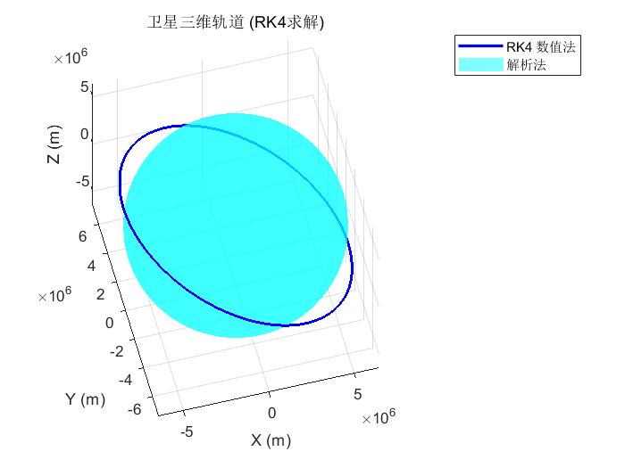
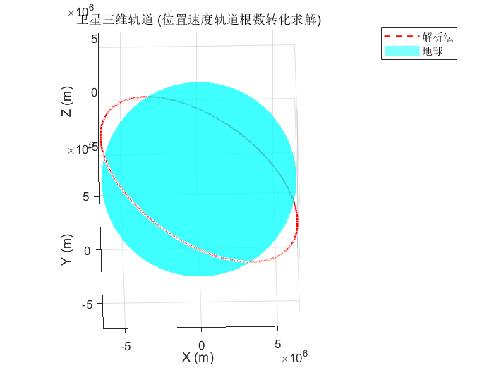
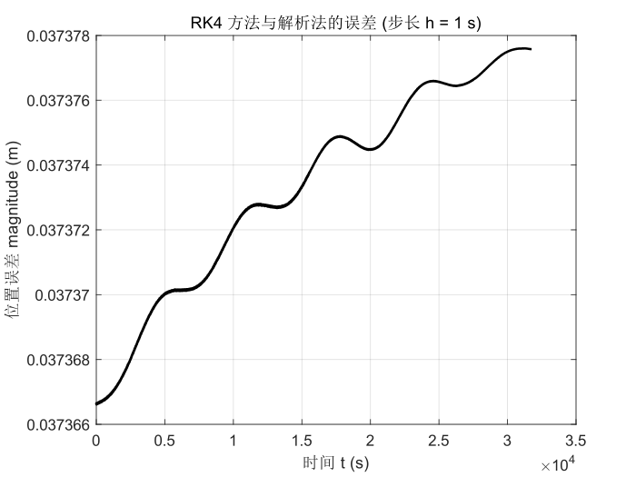

# 实验一. 航天器轨道计算

---

卫星在惯性系下的初始状态为：
$$\mathbf{r}_0 = -6311227.13644808 \mathbf{\hat{I}} - 1112839.62553522 \mathbf{\hat{J}} + 3700000 \mathbf{\hat{K}} \text{ （米）}$$$$\mathbf{v}_0 = 1274.45143229237 \mathbf{\hat{I}} - 7227.77323794544 \mathbf{\hat{J}} + 2.24700438581515 \times 10^{-13} \mathbf{\hat{K}} \text{ （米/秒）}$$

---

### （1） 利用Matlab解微分方程 $\ddot{\mathbf{r}} = -\frac{\mu}{r^3}\mathbf{r}$，求解卫星的运行轨迹，列出要求解的标量方程，画出三维轨迹图

要求解的标量方程如下所示，之后选择采用RK4方法进行求解。
$$\begin{cases}
\dot{x} = v_x \\
\dot{y} = v_y \\
\dot{z} = v_z \\
\dot{v}_x = -\frac{\mu}{r^3} x \\
\dot{v}_y = -\frac{\mu}{r^3} y \\
\dot{v}_z = -\frac{\mu}{r^3} z
\end{cases}$$其中 $r = \sqrt{x^2+y^2+z^2}$。
采用0.01s的RK4步长，运行五个周期，得到结果如下。


### （2） 利用位置速度与轨道根数之间的转换求解一个周期的卫星的位置、速度，画出位置三维轨迹图。
采用解析法进行求解，运行五个周期，得到结果如下。


### （3） 给出两种计算方法的轨道误差，比较两种方法计算的轨道有无差别。




误差随时间不断积累，但总体上差异较小，但在执行具体任务是仍将成为会影响任务能否正确执行的因素。

```matlab
% 清除工作区
clc; clear; close all;

%% 参数设置
mu = 3.986004418e14; % 地球引力常数 (m^3/s^2)

% 初始状态
r0_vec = [-6311227.13644808; -1112839.62553522; 3700000];
v0_vec = [1274.45143229237; -7227.77323794544; 2.24700438581515e-13];
y0 = [r0_vec; v0_vec];

% 数据预处理
r0 = norm(r0_vec);
v0 = norm(v0_vec);
Energy = v0^2/2 - mu/r0;
a = -mu / (2*Energy);
T_period = 2 * pi * sqrt(a^3 / mu);

fprintf('轨道半长轴 a = %.2f km\n', a/1000);
fprintf('轨道周期 T = %.2f s\n', T_period);

%% RK4

% --- RK4 设置 ---
h = 1; % 步长 s
t_rk4 = 0:h:5*T_period; % 仿真时间
N = length(t_rk4);

% 初始化状态矩阵 [rx, ry, rz, vx, vy, vz]
state_rk4 = zeros(N, 6);
state_rk4(1, :) = y0';   % 零状态初始化

% --- RK4 迭代主循环 ---
y_current = y0; % 当前状态列向量

fprintf('正在进行 RK4 数值积分计算...\n');
for i = 1 : N-1
    t_curr = t_rk4(i);

    % 计算四个斜率 k1, k2, k3, k4
    k1 = OrbitEOM(t_curr, y_current, mu);
    k2 = OrbitEOM(t_curr + h/2, y_current + h*k1/2, mu);
    k3 = OrbitEOM(t_curr + h/2, y_current + h*k2/2, mu);
    k4 = OrbitEOM(t_curr + h, y_current + h*k3, mu);

    % 更新状态
    y_next = y_current + (h/6) * (k1 + 2*k2 + 2*k3 + k4);

    % 保存结果
    state_rk4(i+1, :) = y_next';

    % 更新当前状态进入下一次迭代
    y_current = y_next;
end

r_num = state_rk4(:, 1:3); % 提取 RK4 计算出的位置矢量

%% 位置速度轨道根数转化-解析法

[a, e, i, Omega, omega, M0] = rv2coe(r0_vec, v0_vec, mu); % 零状态初始化

r_ana = zeros(N, 3);

fprintf('正在进行解析法计算...\n');
n = sqrt(mu / a^3); % 平均角速度

for k = 1:N
    t = t_rk4(k);
    M = M0 + n * t;
    E = KeplerSolver(M, e);

    sin_nu = (sqrt(1 - e^2) * sin(E)) / (1 - e * cos(E));
    cos_nu = (cos(E) - e) / (1 - e * cos(E));
    nu = atan2(sin_nu, cos_nu);

    [r_vec_t, ~] = coe2rv(a, e, i, Omega, omega, nu, mu);
    r_ana(k, :) = r_vec_t';
end

%% 误差

% --- 三维轨道 ---
figure('Name', 'RK4', 'Color', 'w');
plot3(r_num(:,1), r_num(:,2), r_num(:,3), 'b', 'LineWidth', 2); hold on;
[X, Y, Z] = sphere(50);
R_earth = 6378137;
surf(X*R_earth, Y*R_earth, Z*R_earth, 'FaceColor', 'c', 'EdgeColor', 'none', 'FaceAlpha', 0.5);
axis equal; grid on;
xlabel('X (m)'); ylabel('Y (m)'); zlabel('Z (m)');
legend('RK4 数值法', '解析法', '地球');
title('卫星三维轨道 (RK4求解)');
view(3);

% --- 三维轨道 ---
figure('Name', 'Analytical', 'Color', 'w');
plot3(r_ana(:,1), r_ana(:,2), r_ana(:,3), 'r--', 'LineWidth', 1.5); hold on;
[X, Y, Z] = sphere(50);
R_earth = 6378137;
surf(X*R_earth, Y*R_earth, Z*R_earth, 'FaceColor', 'c', 'EdgeColor', 'none', 'FaceAlpha', 0.5);
axis equal; grid on;
xlabel('X (m)'); ylabel('Y (m)'); zlabel('Z (m)');
legend('解析法', '地球');
title('卫星三维轨道 (位置速度轨道根数转化求解)');
view(3);

% --- 误差分析 ---
pos_err = sqrt(sum((r_num - r_ana).^2, 2)); % 位置误差模长

figure('Name', 'RK4 Error Analysis', 'Color', 'w');
plot(t_rk4, flip(pos_err), 'k', 'LineWidth', 1.5);
grid on;
xlabel('时间 t (s)');
ylabel('位置误差 magnitude (m)');
title(['RK4 方法与解析法的误差 (步长 h = ' num2str(h) ' s)']);

fprintf('\n--- 结果比较 ---\n');
fprintf('RK4 步长: %.4f 秒\n', h);
fprintf('最大位置误差: %.4e 米\n', max(pos_err));


%% --- 辅助函数 ---

% 1. 轨道动力学微分方程
    function dydt = OrbitEOM(~, y, mu)
        r_vec = y(1:3);
        v_vec = y(4:6);
        r_mag = norm(r_vec);
        a_vec = -mu / (r_mag^3) * r_vec;
        dydt = [v_vec; a_vec];
    end

% 2. 开普勒方程求解器
    function E = KeplerSolver(M, e)
        E = M;
        if e > 0.8, E = pi; end
        tol = 1e-13; ratio = 1;
        while abs(ratio) > tol
            f = E - e*sin(E) - M;
            df = 1 - e*cos(E);
            ratio = f / df;
            E = E - ratio;
        end
    end

% 3. RV转COE
    function [a, e_mag, i, Omega, omega, M0] = rv2coe(r_vec, v_vec, mu)
        r = norm(r_vec); v = norm(v_vec);
        h_vec = cross(r_vec, v_vec); h = norm(h_vec);
        n_vec = cross([0;0;1], h_vec); n = norm(n_vec);
        e_vec = (1/mu) * ((v^2 - mu/r)*r_vec - dot(r_vec, v_vec)*v_vec);
        e_mag = norm(e_vec);
        energy = v^2/2 - mu/r;
        a = -mu / (2*energy);
        i = acos(h_vec(3) / h);
        if n ~= 0
            Omega = acos(n_vec(1) / n);
            if n_vec(2) < 0, Omega = 2*pi - Omega; end
            omega = acos(dot(n_vec, e_vec) / (n*e_mag));
            if e_vec(3) < 0, omega = 2*pi - omega; end
        else
            Omega = 0; omega = 0;
        end
        nu = acos(dot(e_vec, r_vec) / (e_mag*r));
        if dot(r_vec, v_vec) < 0, nu = 2*pi - nu; end
        E0 = 2 * atan(sqrt((1-e_mag)/(1+e_mag)) * tan(nu/2));
        M0 = E0 - e_mag * sin(E0);
    end

% 4. COE转RV
    function [r_vec, v_vec] = coe2rv(a, e, i, Omega, omega, nu, mu)
        p = a * (1 - e^2); r = p / (1 + e*cos(nu));
        r_pqw = [r*cos(nu); r*sin(nu); 0];
        v_pqw = sqrt(mu/p) * [-sin(nu); e+cos(nu); 0];
        cO = cos(Omega); sO = sin(Omega); co = cos(omega); so = sin(omega); ci = cos(i); si = sin(i);
        R = [ cO*co-sO*so*ci, -cO*so-sO*co*ci,  sO*si;
            sO*co+cO*so*ci, -sO*so+cO*co*ci, -cO*si;
            so*si,           co*si,           ci ];
        r_vec = R * r_pqw; v_vec = R * v_pqw;
    end
```