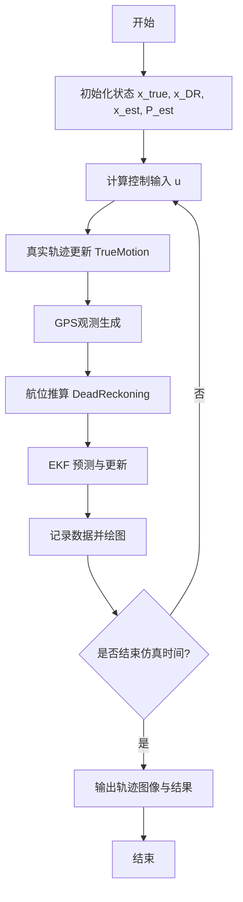

# 扩展卡尔曼滤波（EKF）定位仿真技术文档

## 一、系统概述

本文档介绍基于 Python 的扩展卡尔曼滤波（EKF, Extended Kalman Filter）在移动机器人定位问题中的仿真实现。  
系统通过以下四种轨迹对比验证滤波性能：

1. **真实轨迹（True Trajectory）**：理想状态下的真实运动路径；  
2. **GPS 观测轨迹（Observation / GPS Measurement）**：在真实轨迹上叠加测量噪声后的观测数据；  
3. **航位推算轨迹（Dead Reckoning, DR）**：由带噪声的控制输入推算得到的估计轨迹；  
4. **EKF 估计轨迹（EKF Estimated Trajectory）**：通过融合控制输入与GPS观测获得的最优估计轨迹。

---

## 二、系统状态定义

系统状态向量定义为：

\[
\mathbf{x} = 
\begin{bmatrix}
x \\ y \\ \psi \\ v
\end{bmatrix}
\]

其中：
- \(x, y\)：位置坐标；
- \(\psi\)：航向角；
- \(v\)：线速度。

控制输入为：

\[
\mathbf{u} = 
\begin{bmatrix}
v \\ \dot{\psi}
\end{bmatrix}
\]

即线速度与角速度。

---

## 三、轨迹建模过程

### 1. 真实轨迹建模（True Trajectory）

真实运动模型（理想状态）由系统运动方程定义：

\[
\mathbf{x}_{k+1} = f(\mathbf{x}_k, \mathbf{u}_k) =
\begin{bmatrix}
x_k + v_k \Delta t \cos(\psi_k) \\
y_k + v_k \Delta t \sin(\psi_k) \\
\psi_k + \dot{\psi}_k \Delta t \\
v_k
\end{bmatrix}
\]

该模型假设控制输入无噪声，轨迹连续光滑。

#### 伪代码
```
function TrueMotion(x, u, Δt):
    x_next = x + v * cos(ψ) * Δt
    y_next = y + v * sin(ψ) * Δt
    ψ_next = ψ + yaw_rate * Δt
    v_next = v
    return [x_next, y_next, ψ_next, v_next]
```

---

### 2. GPS观测轨迹建模（Observation / Measurement Trajectory）

观测模型为：

\[
\mathbf{z}_k = H \mathbf{x}_k + \mathbf{w}_k
\]

其中 \(H\) 为观测矩阵：

\[
H = 
\begin{bmatrix}
1 & 0 & 0 & 0 \\
0 & 1 & 0 & 0
\end{bmatrix}
\]

测量噪声 \(\mathbf{w}_k \sim \mathcal{N}(0, Q_{sim})\)。

即：

\[
z_x = x_{true} + \epsilon_x,\quad
z_y = y_{true} + \epsilon_y
\]

#### 伪代码
```
function GPSObservation(x_true, Q_sim):
    zx = x_true.x + random_noise(Q_sim[0,0])
    zy = x_true.y + random_noise(Q_sim[1,1])
    return [zx, zy]
```

---

### 3. 航位推算轨迹建模（Dead Reckoning Trajectory）

航位推算依赖带噪声的控制输入进行积分，公式为：

\[
\mathbf{x}_{DR, k+1} = f(\mathbf{x}_{DR, k}, \mathbf{u}_k + \boldsymbol{\eta}_u)
\]

其中 \(\boldsymbol{\eta}_u\) 为输入噪声，满足 \(\boldsymbol{\eta}_u \sim \mathcal{N}(0, R_{sim})\)。

该方法不利用外部观测，因此误差随时间积累。

#### 伪代码
```
function DeadReckoning(x_DR, u, R_sim):
    u_noisy = u + random_noise(R_sim)
    x_DR_next = MotionModel(x_DR, u_noisy)
    return x_DR_next
```

---

### 4. EKF估计轨迹建模（EKF Estimated Trajectory）

EKF通过预测与更新两步融合控制输入与观测信息：

#### (1) 预测（Prediction）

\[
\hat{\mathbf{x}}^-_k = f(\hat{\mathbf{x}}_{k-1}, \mathbf{u}_k)
\]
\[
P^-_k = F_k P_{k-1} F_k^T + Q
\]

#### (2) 更新（Update）

\[
\mathbf{y}_k = \mathbf{z}_k - H \hat{\mathbf{x}}^-_k
\]
\[
K_k = P^-_k H^T (H P^-_k H^T + R)^{-1}
\]
\[
\hat{\mathbf{x}}_k = \hat{\mathbf{x}}^-_k + K_k \mathbf{y}_k
\]
\[
P_k = (I - K_k H) P^-_k
\]

#### 伪代码
```
function EKF(x_est, P_est, z, u, Q, R):
    # 预测
    x_pred = MotionModel(x_est, u)
    F = JacobianF(x_pred, u)
    P_pred = F * P_est * F.T + Q

    # 更新
    H = JacobianH(x_pred)
    z_pred = H * x_pred
    y = z - z_pred
    S = H * P_pred * H.T + R
    K = P_pred * H.T * inverse(S)
    x_est = x_pred + K * y
    P_est = (I - K * H) * P_pred

    return x_est, P_est
```

---

## 四、协方差椭圆建模
1. 提取协方差矩阵
协方差矩阵 \(P_{xy}\) 的前 2×2 部分反映了位置误差的分布。  
通过特征值分解：
\[
P_{xy} = V \Lambda V^T
\]
其中：
- \(V\)：特征向量矩阵（表示主方向）；
- \(\Lambda = \text{diag}(\lambda_1, \lambda_2)\)：特征值（表示方差主轴长度）。
**几何意义：**
- 特征值越大 → 不确定性越大；
- 特征向量决定椭圆方向。
- 用图形直观地展示系统位置估计的不确定性范围。

协方差椭圆半轴长度为 \(\sqrt{\lambda_1}\) 和 \(\sqrt{\lambda_2}\)，方向由 \(V\) 决定。

2. 计算 \(P_{xy}\) 的特征值和特征向量。
\[
P_{xy} =
\begin{bmatrix}
P_{xx} & P_{xy} \\
P_{yx} & P_{yy}
\end{bmatrix}
\]
3. 生成单位圆 \((\cos\theta, \sin\theta)\)。
\[
\begin{cases}
x = a \cos(t) \\
y = b \sin(t)
\end{cases}, \quad t \in [0, 2\pi]\\
a = \sqrt{\lambda_{\max}}, \quad
b = \sqrt{\lambda_{\min}}, \quad
\]


4. 通过 \(R = V\) 旋转并缩放；
\[
R =
\begin{bmatrix}
\cos\theta & \sin\theta \\
-\sin\theta & \cos\theta
\end{bmatrix} ,
\theta = \arctan2(v_{y}, v_{x})\\
\begin{bmatrix}
x' \\ y'
\end{bmatrix}
= R
\begin{bmatrix}
x \\ y
\end{bmatrix}
\]
5. 平移到估计位置中心\((x_{est}, y_{est})\)。
\[
x'' = x' + x_{est}, \quad y'' = y' + y_{est}
\]
#### 伪代码
```
function PlotCovarianceEllipse(x_est, P_est):
    Pxy = P_est[0:2, 0:2]
    eigval, eigvec = eig(Pxy)
    a = sqrt(max(eigval))
    b = sqrt(min(eigval))
    θ = atan2(eigvec[big_index,1], eigvec[big_index,0])
    ellipse_points = rotate_and_scale(a, b, θ)
    draw ellipse centered at (x_est[0], x_est[1])
```

---

## 五、整体算法流程



---

## 六、结果与可视化说明

输出图像包括以下轨迹与符号：

| 颜色 | 含义 |
|------|------|
| 蓝线 | 真实轨迹（True Trajectory） |
| 黑线 | 航位推算轨迹（Dead Reckoning） |
| 绿点 | GPS观测（Measurement） |
| 红线 | EKF估计轨迹（Estimated Trajectory） |
| 红色虚线椭圆 | EKF协方差椭圆（Covariance Ellipse） |

---

## 七、参考方程总结

| 名称 | 方程 |
|------|------|
| 状态转移方程 | \( \mathbf{x}_{k+1} = f(\mathbf{x}_k, \mathbf{u}_k) + \mathbf{w}_k \) |
| 观测方程 | \( \mathbf{z}_k = H\mathbf{x}_k + \mathbf{v}_k \) |
| 协方差预测 | \( P^-_k = F_k P_{k-1} F_k^T + Q \) |
| 卡尔曼增益 | \( K_k = P^-_k H^T (H P^-_k H^T + R)^{-1} \) |
| 状态更新 | \( \mathbf{x}_k = \mathbf{x}^-_k + K_k (\mathbf{z}_k - H\mathbf{x}^-_k) \) |
| 协方差更新 | \( P_k = (I - K_k H) P^-_k \) |
| 协方差椭圆 | \( P_{xy} = V \Lambda V^T \), \(a=\sqrt{\lambda_1}, b=\sqrt{\lambda_2}\) |

---

## 八、文件输出

- **图像文件**：`ekf_result.png`  
- **内容**：展示真实轨迹、航位推算轨迹、观测点与EKF估计轨迹。  
- **保存路径**：程序工作目录。
