# 飞行器信息融合理论及应用复习资料

## 一、填空题

### 1.对于多源信息融合的通用处理结构，分哪几种模式？各个模式特点？
通用处理结构有集中式、分布式、混合式结构。
- 集中式：处理传感器原始数据；
- 分布式：经过预处理的局部数据；
- 混合式：处理上述两种数据。

各个模式特点：
- 集中式：在融合中心进行全部工作，信息损失小；但对通信要求高，中心计算负担重，生存能力差；
- 分布式：接收局部航迹，形成全局估计；可靠性高，通信量小
- 混合式：综合性能较好，应用较多。
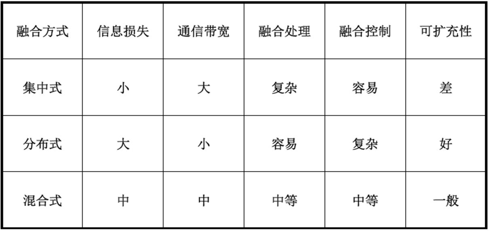

### 2.信息融合功能模型可以分为四级处理，分别是哪几级？其中目标评估主要功能又包括哪几种内容？

可以分为以下四级处理：
- 第一级处理，**目标评估**：主要功能包括数据配准、数据关联、目标位置和运动学参数估计，以及属性参数估计、身份估计等，其结果为更高级别的融合过程提供辅助决策信息。
- 第二级处理，**态势评估**：用于态势抽象与评定。
- 第三级处理，**影响评估/威胁估计**：将当前态势映射到未来，对参与者设想或预测行为的影响进行评估。
- 第四级处理，**过程评估**：通过建立一定的优化指标，对整个融合过程进行监控与评价、实现多传感器系统自适应信息获取与处理，以及资源的最优分配，以支持特定的任务目标，并最终提高总体系统的性能。

### 3.在多传感信息融合中，对接收到的量测数据有时会存在多种解释，称为数据的什么？
在多传感信息融合系统中，对传感器接收到的量测数据有时会存在多种解释，称之为数据的**不完整性**；

### 4.多传感器数据可能在什么级别上？这些数据可以是稀疏的也可以是稠密的。
多传感器提供的数据可能是在**不同的粒度**级别上。这些数据可以是稀疏的，也可以是稠密的；它们也可能分别处于数据级、特征级，或是符号级各种不同的抽象级别上，所以一个可行的融合方案应该可以工作在各种不同的粒度级别上。
### 5.在信息融合系统中，每个传感器提供的观测数据都在各自的参考框架之内，将它们变换到同一个时间参考框架和坐标参考框架中去的技术分别是什么？
数据配准：将多源数据纳入一个统一参考框架（时间同步或对准、坐标变换或空间配准）
- **时间同步或对准**：变换到同一个时间参考框架
- **坐标变换或空间配准**：变换到同一个坐标参考框架
### 6.最优估计的一般过程包括哪几个过程？
1. 系统建模
2. 测量建模
3. 误差分析
4.  基于某种最优规则构建最优估计算法（按照最优准则，确定估计系数）
5. 得到估计结果
### 7.按照最优准则，通常可以利用哪几个条件，来构建最优估计结果？
基于线性、无偏和估计偏差方差最小的最优准则
### 8.随机变量 \(X\) 的期望又称什么？具体定义是什么？
随机变量\(X\)的期望又称\(X\)的均值或一阶矩，定义为
\[
    E(X)=\int_{-\infty}^{\infty }xf(x)dx
\]
### 9.随机变量 X 的方差是什么？具体定位是什么？
一个随机变量的方差是该随机变量对其平均值的均方偏差，即
\[
    D(X)=\sigma^2=\int_{-\infty}^{\infty }[x-E(X)]^2 f(x)dx=E(X^2)-E(X)^2
\]
### 10.随机变量、随机过程的定义是什么？
在概率论与数理统计书上：
- **随机变量**：设随机试验的样本空间为\(S={e}。X=X(e)\)是定义在样本空间S上的实值单值函数，称\(X=X(e)\)为随机变量。
- **随机过程**：用\(T\)表示一无限实数集，我们把依赖于\(t\in T\)的一族随机变量\( \{X_t,t\in T\} \)成为随机过程，\(T\)叫做参数集。
在KALMAN滤波基础书上：
- **随机变量**：描述某个随机事件的概率取值情况的变量，称为随机变量。
- **随机过程**：一个随机过程可看成时间函数的集合，用\( \{X(t)\}\)表示，样本空间中的每个元素对应一个时间函数。一个随机过程也可以看成随机变量簇，用\( \{X(t),t\in T\} \)表示，其中\(T\)为时间参数集，可能取值的集合称为过程的状态空间。
### 11.最优估计的一般过程包括哪几个过程？按照什么来确定估计系数得到估计结果？
- 过程：1. 系统建模。2. 测量建模。3. 误差分析。4. 基于某种最优规则构建最优估计算法（按照最优准则，确定估计系数）。5. 得到估计结果。
- 按照最优准则，确定估计系数。
### 12.用于衡量随机变量或一组数据的离散程度的通常什么表示？一个随机变量和另一个随机变量联系程度的部分特征通常由什么表示？
- 方差：用于衡量随机变量或一组数据的离散程度
- 协方差：一个随机变量和另一个随机变量联系程度的部分特征由协方差给出，定义为
\[
\begin{aligned}
\operatorname{Cov}(X,Y) &= E\{[X - E(X)] [Y - E(Y)]\} \\
&= \int_{-\infty}^{\infty} \int_{-\infty}^{\infty} [x - E(X)] \, [y - E(Y)] \, f_2(x,y) \, dx \, dy \\
&= E(XY) - E(X)E(Y)
\end{aligned}
\]
该两个随机变量之间的相关系数定义为
\[
    \rho = \frac{\operatorname{Cov}(X,Y)}{\sigma_X\sigma_Y}    
\]
### 13.如果一个随机过程的所有统计特性都能由其一条时间样本以足够高的精度得到，那么称该随机过程具有什么特性？
具有**各态历经性**。
### 14.LS估计的优势在于其应用条件宽松，只需要建什么即可？且无需对什么进行建模？对什么等均无要求？
只需要建立**测量模型**即可，无需对**测量噪声**进行建模。对**状态的分布**、**是否为随机过程**等均无要求。
### 15.条件概率分布密度函数最大估计分？？最大这两种？具体名称分别称为什么？它们的最优准则分别是什么？
分为**验前条件概率分布密度函数最大**和**验后条件概率分布密度函数最大**两种，分别称为**极大似然估计**和**极大验后估计**。
- **极大似然估计（验前条件概率分布密度函数最大）**：设测量向量 $\textbf{z}$ 在状态向量 $\textbf{x}$ 已知的情况下的条件概率分布密度函数为 $p(\textbf{z}|\textbf{x})$，该密度函数也称为似然概率分布密度函数。如果估计值 $\hat{\textbf{x}}_{ML}(\textbf{z})$ 使
\[
p(\textbf{z}|\textbf{x}) |_{\textbf{x}=\hat{\textbf{x}}_{ML}(\textbf{z})}\to max（最优准则）
\]则称\(\hat{\textbf{x}}_{MA}\)为$\textbf{x}$的极大似然估计。
- **极大验后估计（验后条件概率分布密度函数最大）**：设状态向量 $\textbf{x}$ 在测量向量 $\textbf{z}$ 已知的情况下的条件概率分布密度函数为 $p(\textbf{x}|\textbf{z})$，该密度函数也称为验后概率分布密度函数。如果估计值 $\hat{\textbf{x}}_{MA}(\textbf{z})$ 使
\[
p(\textbf{x}|\textbf{z}) |_{\textbf{x}=\hat{\textbf{x}}_{MA}(\textbf{z})}\to max（最优准则）
\]则称\(\hat{\textbf{x}}_{MA}\)为$\textbf{x}$的极大验后估计。
### 16. Kalman 滤波量测更新后的什么矩阵反映的是状态估计偏离其真值的协方差？基于此可以判断什么？ Kalman 滤波的什么矩阵是调节加权权重的参数？
- **估计偏差协方差矩阵（通常记为P）** 反映的是状态估计偏离其真值的协方差。
基于此可以判断：
  1. 估计精度：P矩阵的对角线元素表示各个状态分量估计误差的方差，值越小表示估计越精确
  2. 不确定性程度：P矩阵的迹（对角线元素之和）反映了总体估计不确定性
  3. 状态间的相关性：非对角线元素表示不同状态分量估计误差之间的相关性
  4. 滤波器收敛性：随着滤波进行，P矩阵逐渐减小并趋于稳定，表明滤波器收敛
  5. ai给出以上四条
- Kalman滤波中的**增益矩阵（通常记为K）** 是调节加权权重的参数.
### 17.统计特性不随时间变化，且完全由前二阶矩确定，称为什么？一个平稳随机过程的功率谱密度函数在整个频域均为非零常值，则称其为什么？
- **平稳性**：统计特性不随时间变化，且完全由前二阶矩确定
- **白噪声**:指功率谱密度在整个频域内是常数的噪声。 所有频率具有相同能量密度的随机噪声称为白噪声。
### 18.当系统噪声和量测噪声都是有色噪声时，先进行什么扩展，再进行什么扩展，使量测噪声被白化？此时可利用 Kalman 滤波基本方程组。
1. 先进行**状态扩展**，将有色系统噪声建模为新的状态变量
2. 再进行**量测扩展**，通过差分或变换使量测噪声被白化p181
### 19.估计融合前通常需要进行什么操作，从而决定来自不同传感器的哪些量测属于同一目标？
实际应用中，估计融合前通常需要进行**数据关联**，以决定来自不同传感器的哪些量测属于同一目标。
在分布式多传感系统中，为了对由多个局部传感器输出的多目标航迹数据进行融合，需要进行“航迹一航迹”的数据关联，以确定哪些局部航迹源于同一个被跟踪的目标。
### 20.为了更新航迹，维持跟踪的持续性，还需要进行什么关联以确定用于航迹修正的新观测数据？
为了更新航迹，维持跟踪的持续性，还需要进行 **“量测-航迹”关联** 以确定用于航迹修正的新观侧数据。
### 21.态势评估是对战场上战斗力量分配情况的评价过程，并最终形成包括哪三种视图？分别代表什么？
- 红色视图——我方态势，
- 蓝色视图——敌方态势，
- 白色视图——天气、地理及第三方等战场态势在内的综合态势图。
### 22. 极大似然估计与极大验收估计定义？及其最优准则是什么？
- **极大似然估计（验前条件概率分布密度函数最大）**：设测量向量 $\textbf{z}$ 在状态向量 $\textbf{x}$ 已知的情况下的条件概率分布密度函数为 $p(\textbf{z}|\textbf{x})$，该密度函数也称为似然概率分布密度函数。如果估计值 $\hat{\textbf{x}}_{ML}(\textbf{z})$ 使
\[
p(\textbf{z}|\textbf{x}) |_{\textbf{x}=\hat{\textbf{x}}_{ML}(\textbf{z})}\to max（最优准则）
\]则称\(\hat{\textbf{x}}_{MA}\)为$\textbf{x}$的极大似然估计。
- **极大验后估计（验后条件概率分布密度函数最大）**：设状态向量 $\textbf{x}$ 在测量向量 $\textbf{z}$ 已知的情况下的条件概率分布密度函数为 $p(\textbf{x}|\textbf{z})$，该密度函数也称为验后概率分布密度函数。如果估计值 $\hat{\textbf{x}}_{MA}(\textbf{z})$ 使
\[
p(\textbf{x}|\textbf{z}) |_{\textbf{x}=\hat{\textbf{x}}_{MA}(\textbf{z})}\to max（最优准则）
\]则称\(\hat{\textbf{x}}_{MA}\)为$\textbf{x}$的极大验后估计。
### 23. 当系统噪声为有色噪声时，Kalman 滤波通常采用什么方法来实现最优估计？
1. 成型滤波器法
2. 时间序列分析法
3. Allan方差法
### 24. 当系统噪声和量测噪声都是有色噪声时，要先怎么处理然后再怎么处理之后采用Kalman滤波基本方程组？
1. 先进行**状态扩展**，将有色系统噪声建模为新的状态变量
2. 再进行**量测扩展**，通过差分或变换使量测噪声被白化p181
### 25. 观测数据直接融合需要进行什么关联来稳定航迹生存周期？
观测数据的直接融合也需要进行 **“量测一量测”关联** ，以稳定航迹生存周期;
### 26. 为了更新航迹，维持跟踪的持续性，还需要进行什么关联以确定用于航迹修正的新观侧数据？
为了更新航迹，维持跟踪的持续性，还需要进行 **“量测-航迹”关联** 以确定用于航迹修正的新观侧数据。
### 27. 在空战应用的态势评估中，空中背景就是整个系统运作？？，作为？？的参战飞机在指挥命令的引导下，其运动状态发生改变，这就意味着？？发生。
空中背景就是整个系统运作**环境**，作为**实体**的参战飞机在指挥命令的引导下，其运动状态发生改变，这就意味着**事件**的发生。
## 二、判断题
### 1.信息融合的功能是将来自多个传感器和信息源的数据和信息加以联合…..完整评价（考察信息融合功能定义）
- **正确**
- 实际定义：将来自多个传感器和信息源的数据和信息加以联合、相关、组合，以获得对目标精确的位置估计、身份估计、对战场情况和威胁及其重要程度进行适时的完整评价。
### 2.信息融合中的滤波是从根据初始到当前时刻的所有测量结果，对未来某一时刻的状态进行估计的过程（滤波、平滑、预测的含义）
- **错误**
- 1. 预测：利用从初始时刻到当前时刻的所有测量结果，对未来某一时刻的状态进行估计的过程。
  2. 滤波：利用从初始时刻到当前时刻的所有测量结果，对当前时刻的状态进行估计的过程。
  3. 平滑：利用从初始时刻到当前时刻的所有测量结果，对过往某一时刻的状态进行估计的过程。
### 3.当测量结果的精度不同时，采用 LS 估计的信息融合结果是否一定比单次测量的精度高？
- **错误**
- LS估计算法并不能考虑测量精度的差异，导致估计精度比单次测量的低（书上p97）。
### 4.如果$\textbf{X}$的任何验前知识都没有，则此时极大验后估计与极大似然估计精度比较如何？
在统计学中，极大验后估计（MAP）和极大似然估计（MLE）都是参数估计方法。当参数 $\textbf{X}$ 没有任何验前知识（即先验信息）时，通常使用无信息先验（如均匀分布）。在这种情况下，MAP估计与MLE估计等价，因为后验概率与似然函数成比例，最大化后验概率等价于最大化似然函数。
因此，从估计精度来看，当没有验前知识时，MAP估计和MLE估计的精度是相同的。具体表现为：
- 估计值相同：两者会得到相同的点估计。
- 渐近性质相同：在大样本条件下，两者都是渐近无偏和渐近有效的，估计误差的方差达到Cramér-Rao下界。

总之，在没有验前知识的条件下，极大验后估计与极大似然估计在精度上**没有区别**。(ai给出)
### 5.KF算法中只是对状态的期望和协方差进行了估计，只适用于线性系统？
- **正确**
- 卡尔曼滤波（Kalman filtering）是一种利用线性系统状态方程，通过系统输入输出观测数据，对系统状态进行最优估计的算法。由于观测数据中包括系统中的噪声和干扰的影响，所以最优估计也可看作是滤波过程。
### 6.EKF基于高斯分布假设，是不是彻底的非线性非高斯算法？
- **不是**
- 扩展卡尔曼滤波（Extended Kalman Filter，EKF）通过局部线性来解决非线性的问题。将非线性的预测方程和观测方程进行求导，以切线代替的方式来线性化。其实就是在均值处进行一阶泰勒展开。（p232）
### 7. 卡尔曼滤波的增益矩阵 K、测量噪声 R、 系统噪声矩阵 Q 等之间关系？增大或减小某个参数后，会引起哪些变化?（Kalman 滤波器调节机理）
k表示第k时刻,$\textbf{P}_k(-)$为一步预测的估计偏差协方差矩阵，$\textbf{P}_k(+)$为估计偏差协方差矩阵。
当$\textbf{R}_k$增大时，$\textbf{K}_k$将减小，即分配给当前测量值的权重减少，这显然是合理的，因为 $\textbf{R}_k$增大，意味着测量精度下降，因而给精度低的测量量分配较小的权重；反之，如果 $\textbf{R}_k$减小，则 $\textbf{K}_k$将增大。当 $\textbf{P}_k(-)$增大时，意味着一步预测的精度下降，$\textbf{K}_k$将增大，即分配给测量值更大的权重；反之，$\textbf{K}_k$将减小，分配给一步预测值更大的权重。影响 $\textbf{P}_k(-)$大小的因素有 $\textbf{P}_{k-1}(+)$和 $\textbf{Q}_{k-1}$，即上一时刻的状态估计偏差和状态噪声均对当前时刻的状态预测产生影响。
### 8. 尽管白噪声在时域是否可实现？是否可预测？
- 不可实现，不可预测：白噪声无记忆性，不同时刻之间完全不相关，白噪声的功率是无穷大的，在$\tau=0$时的自相关函数也是无穷大的，这说明白噪声是不可实现的。
### 9. 采用衰减记忆法、限定记忆法、自适应滤波的 Kalman 滤波等，是否是最优滤波？或者是否是次优滤波？
- **均是次优滤波** p204

对于线性系统来说，当满足一定条件时，可以实现某种意义上的最优滤波。如第5章中的标准 Kalman 滤波在一定条件下就是一种线性、无偏和最小方差估计，其中条件包括线性、模型精确和初始条件准确等，而在现实中往往很难满足这些条件，如前文提到的量测噪声和状态噪声建模不精确而导致的滤波误差增大甚至发散问题，此时滤波通常都不是最优的，因此，前文所提到的衰减记忆法、限定记忆法和自适应滤波等都不是最优的，而是次优滤波。需要注意的是，虽然计算误差也是滤波发散的因素之一，但在建模精确的情况下，平方根滤波和 UD 分解滤波算法是最优的。
### 10.当状态模型不准确或者准确，测量值和测量模型较准确或者不准确时，是否可以可通过增加或者减小当前测量值的加权系数，来抑制滤波发散现象？
- **可以**
- 该方法称为下限增益法，克服了滤波发散问题。受此启发，当状态模型不准确，而测量值和测量模型较准确时，可通过加大当前测量值的加权系数，同时降低早期量测值的加权系数来抑制滤波发散现象。下面的衰减记忆法和限定记忆法就是在此思路上提出的。p193
### 11.基于UT变换的滤波算法又称为什么算法？但是Sigma点算法不只是基于UT变换的滤波算法，其他基于状态统计特征近似的滤波算法是否也可称为Sigma点算法？
- **无迹卡尔曼滤波UKF算法**
- p236因此，这些采样点通常称为Sigma点，因而基于UT变换的滤波算法又称为Sigma点算法，不过，Sigma点算法不只是基于UT变换的滤波算法，其他基于状态统计特征近似的滤波算法也称为Sigma点算法，如中心差分滤波器(Central Difference Filter, CDF)。
### 12. 态势的基本元素包括哪 5 个？其中两个最活跃的元素是哪几个？
- 态势的基本元素包括**环境**、**实体**、**事件**、**组**和**行动**。
- 态势的两个最活跃的元素是**实休**和**事件**。
### 13. 卡尔曼滤波算法是否可以用于一维或多维状态估计？
- **可以**
- p6KF算法既可以用于一维状态估计，也可以用于多维状态估计；而WF算法通常很难用于多维度状态估计
### 14. 系统噪声或者测量噪声是不是卡尔曼滤波需要滤除的对象？
- 系统噪声和测量噪声并**不是**需要滤除的对象，而且它们的统计特征正是估计过程中要利用的信息。
### 15. 状态扩展的办法可以解决噪声白化问题，对于系统噪声为有色噪声和量测噪声为有色噪是否是都可以状态扩展？
- **不可以**
- 应先状态拓展，白化系统噪声；再量测拓展，使量测噪声被白化p181
### 16. 序贯处理实质上是依据量测方程的形式，将其分为若干解耦部分，依次作为测量信息进行处理，从而降低数据处理的计算量？？
- p187序贯处理实质上是依据量测方程的形式，将其分为若干解耦部分，依次作为测量信息进行处理，从而降低了数据处理的计算量。
### 17. 当状态模型不准确或者准确，而测量值和测量模型较准确或者不准确时，采用何种手段降低滤波发散？
- 1. **状态模型准确，测量模型不准确**：

- 2. **状态模型不准确，测量模型准确**：当状态模型不准确，而测量值和测量模型较准确时，可通过加大当前测量值的加权系数，同时降低早期量测值的加权系数来抑制滤波发散现象。
- 3. **状态模型不准确，测量模型不准确**：

- 4.. **状态模型准确，测量模型准确**：
### 18. 卡尔曼滤波状态统计特性的变化由状态方程和状态噪声实时确定，而状态噪声一般建模为平稳白噪声，因此卡尔曼滤波算法是否适用于平稳过程？是否适用于非平稳过程？
- 平稳过程：卡尔曼滤波完全适用，且能提供最优估计。
- 非平稳过程：卡尔曼滤波也适用，但需要模型设计或参数自适应调整来确保估计性能，防止滤波发散。
- ai给出
### 19. 衰减记忆法、限定记忆法和自适应滤波是最优的还是次优滤波？
- **均是次优滤波** p204

对于线性系统来说，当满足一定条件时，可以实现某种意义上的最优滤波。如第5章中的标准 Kalman 滤波在一定条件下就是一种线性、无偏和最小方差估计，其中条件包括线性、模型精确和初始条件准确等，而在现实中往往很难满足这些条件，如前文提到的量测噪声和状态噪声建模不精确而导致的滤波误差增大甚至发散问题，此时滤波通常都不是最优的，因此，前文所提到的衰减记忆法、限定记忆法和自适应滤波等都不是最优的，而是次优滤波。需要注意的是，虽然计算误差也是滤波发散的因素之一，但在建模精确的情况下，平方根滤波和 UD 分解滤波算法是最优的。
### 20. 在建模精确的情况下，平方根滤波和 UD 分解滤波算法是否最优的？
**是最优的**
但在建模精确的情况下，平方根滤波和 UD 分解滤波算法是最优的。
### 21. 多传感器信息融合测量数据中的固定误差，即通常所说的系统误差，它不随测量次数变化，这个误差是否可以修正？
- **可以**另一种固定误差，即我们所说的系统误差，它不随测量次数变化，可以通过校正来消除。
### 22. 在检测融合方法中，“与”融合检测准则可大大提高系统的检测概率，但系统的虚警概率是否会提高？
可大大降低系统的虚警概率，但系统检测概率也随之**降低**。
### 23. 态势评估功能要求除了一级融合功能外，是否包括环境勘察功能、社会政治分析功能？
- 态势评估是对战场上战斗力量分配情况的评价过程，指将获得的敌我双方兵力部署、战场环境、地理、气象条件、活动及意图，指挥员特点，甚至**包括**政治、经济因素在内的与战争有关的全部信息进行综合分析、评估，并最终形成包括
## 三、简答题
### 1. 画出 JDL 数据融合功能模型图，并简述其中某几级处理的功能含义？
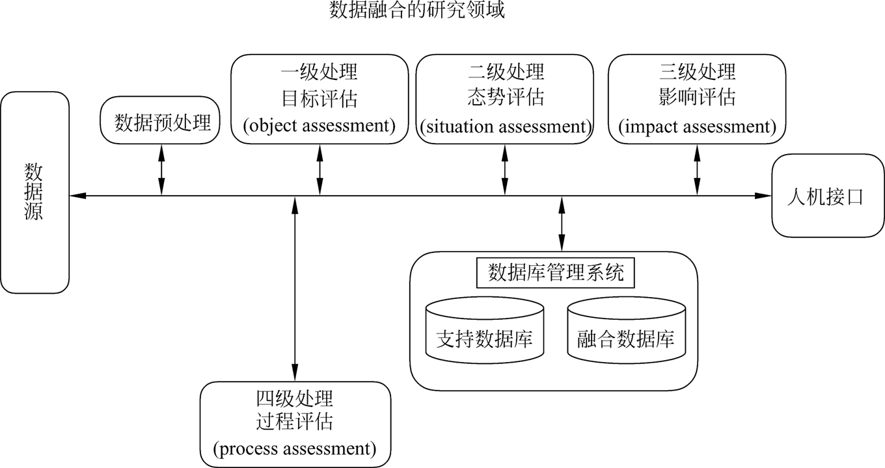
- 第一级处理：目标评估（object assessment）
  主要功能包括数据配准、数据关联、目标位置和运动学参数估计，以及属性参数估计、身份估计等，其结果为更高级别的融合过程提供辅助决策信息。
  - 数据配准：将多源数据纳入一个统一参考框架（时间对准、坐标变换）
  - 数据关联：处理分类与组合；
  - 跟踪：实现目标运动参数估计；
  - 身份估计：实现目标属性参数估计
- 第二级处理：态势评估
  用于态势抽象与评定。
  - 态势抽象：根据不完整的数据集构造综合态势表示，从而产生实体间的相互联系的解释；
  - 态势评定：对产生观测事件的态势的表示与理解；
  - 输入：事件检测、状态与身份估计；
  - 输出：所考虑的各种假设的条件概率
- 第三级处理：影响评估/威胁估计
  将当前态势映射到未来，对参与者设想或预测行为的影响进行评估。
- 第四级处理：过程评估
  通过建立一定的优化指标，对整个融合过程进行监控与评价、实现多传感器系统自适应信息获取与处理，以及资源的最优分配，以支持特定的任务目标，并最终提高总体系统的性能。
### 2. 按数据抽象的层次，信息融合的级别可以分为哪几级？并简述各级别的含义及特点
- 按数据抽象的层次，可分为**数据级**、**特征级**与**决策级**。

1. 数据级融合：直接对观测数据进行融合，再提取特征，判断决策。如：图像复合、雷达波形合成等
    - 优点：数据损失小，精度最高；
    - 缺点：数据量大，时间长；要求较高的纠错能力（如野值剔除）；通信量大。

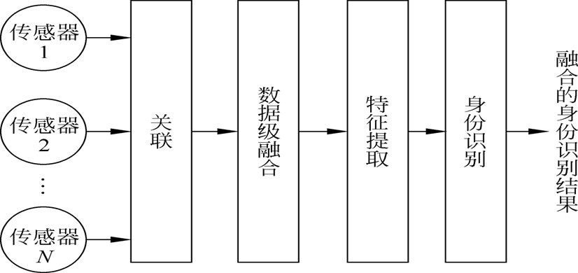

2. 特征级融合：特征信息：数据信息的充分表示量或者统计量
    - 优点：实现较大数据压缩，降低通信带宽需求；
    - 缺点：存在信息损失，性能有所降低；
    - 可以分为：目标状态信息融合（最优估计方法）和目标属性信息融合（模式识别方法）

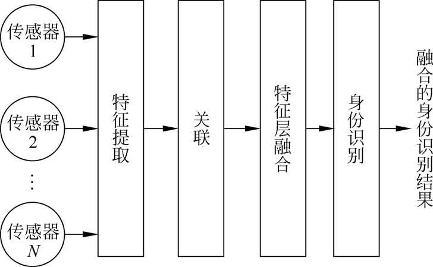

3. 决策级融合：局部决策的融合处理
    - 数据损失最大，通信量最小，抗干扰能力强，对传感器依赖小。

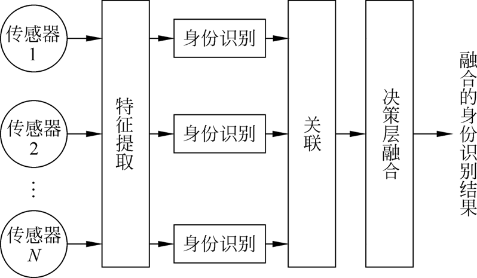
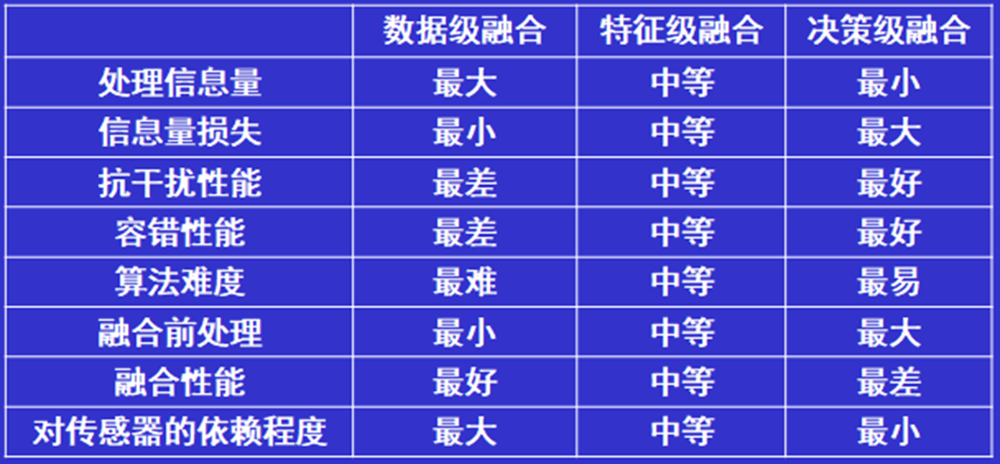
### 3. 多源信息融合通常涉及哪些关键问题？并简述其中的任意几个关键问题
- 数据配准
  1. 在多传感信息融合系统中，每个传感器提供的观测数据都在各自的参考框架之内。
  2. 在对这些信息进行组合之前，必须首先将它们变换到同一个参考框架中去。
  3. 要注意的是，由于多传感时空配准的舍入误差必须得到补偿。
- 同类或异类数据；
  1. 多传感器提供的数据在属性上可以是同类也可是异类的，而且异类多传感器较之同类传感器，其提供的信息具有更强的多样性和互补性；
  2. 同时由于异类数据在时间上的不同步，数据率不一致以及测量维数不匹配等特点，使得对这些信息的融合处理更困难。
- 观测数据的不确定性；
  3. 由于传感器工作环境的不确定性，导致观测数据包含有噪声成分。在融合处理中需要对多源观测数据进行分析验证，并补充综合，在最大限度上降低数据的不确定性。
- 不完整、不一致及虚假数据；
  1. 在多传感信息融合系统中，对传感器接收到的量测数据有时会存在多种解释，称之为数据的不完整性；
  2. 多传感数据往往会对观测环境作出不一致甚至相互矛盾的解释；
  3. 由于噪声及干扰因素的存在，往往存在一些虚假的量测数据。
  4. 信息融合系统需要能够对这些不完整数据、不一致数据以及虚假数据进行有效的融合处理。
- 数据关联；
  数据关联问题广泛存在，需要解决单传感时间域上的关联问题，以及多传感空间域上的关联问题，从而能确定来源于同一目标源的数据。
- 粒度；
  多传感器提供的数据可能是在不同的粒度级别上。这些数据可以是稀疏的，也可以是稠密的；它们也可能分别处于数据级、特征级，或是符号级各种不同的抽象级别上，所以一个可行的融合方案应该可以工作在各种不同的粒度级别上。            
- 态势数据库；
  1. 态势数据库为各个级别上的融合处理提供实时和非实时数据。
  2. 这些数据包括多传感器观测数据、融合的中间结果数据、有关目标和环境的辅助信息以及进行融合处理所需的历史信息等。
  3. 对整个信息融合系统中态势数据库的要求是容量要大、搜索要快、开放互连性要好，并具有良好的人机接口。因此，要开发更有效的数据模型、新的查找和搜索机制，以及分布式多媒体数据库管理系统等。
### 4. 简单推导最小二乘估计算法，并分析其无偏性？
#### LS估计算法（估计偏差平方和最小）
LS估计算法只涉及到量测模型，且并不需要对量测噪声进行分析，因此，应用非常方便。不过，在这里还是按照普通的量测建模方式给出带量测噪声的量测模型如下：
\[\textbf{z} = \textbf{H}\textbf{x} + \textbf{v} \tag{1}
\]其中，$\textbf{z}$ 为 $m$ 维量测向量，$\textbf{x}$ 为 $n$ 维状态向量，$\textbf{H}$ 为 $m \times n$ 维系数矩阵，$\textbf{v}$ 为 $m$ 维量测噪声向量，一般设为零期望白噪声。现在需要根据 $\textbf{z}$ 对 $\textbf{x}$ 进行 LS估计，则估计准则为
\[
  J = (\textbf{z} - \textbf{H}\hat{\textbf{x}})^T(\textbf{z} - \textbf{H}\hat{\textbf{x}}) \tag{2}
\]其中，$\hat{\textbf{x}}$ 为 $\textbf{x}$ 的估计值。由于 $J$ 为向量内积形式，因此如果其存在极值，则一定是极小值，只需求其关于 $\hat{\textbf{x}}$ 的一阶梯度运算，并令其为零向量即可，即
\[\frac{\partial J}{\partial \hat{\textbf{x}}} = -2\textbf{H}^T(\textbf{z} - \textbf{H}\hat{\textbf{x}}) = 0 \tag{3}
\]如果 $(H^T H)$ 可逆，则有
\[\hat{\textbf{x}} = (\textbf{H}^T \textbf{H})^{-1} \textbf{H}^T \textbf{z} \tag{4}
\]此即为 LS 意义上的最优估计结果，该估计形式的系数矩阵实际上是超定时 $\textbf{H}$ 的伪逆。因此，伪逆实际上是 LS 意义上的最优估计结果。
下面分析一下估计结果的性能，采用线性系统中关于估计偏差的分析方法，即分析估计偏差的期望和协方差矩阵，前者确认估计是否是无偏的，后者则给出估计偏差的误差传播方程。先分析 LS 估计的无偏性如下：
\[
\begin{aligned}
E(\widetilde{\textbf{x}}) &= E(\textbf{x} - \hat{\textbf{x}}) = E[\textbf{x} - (\textbf{H}^T \textbf{H})^{-1} \textbf{H}^T \textbf{z}] \\
&= E[(\textbf{H}^T \textbf{H})^{-1} \textbf{H}^T (\textbf{H} \textbf{x} - \textbf{z})] = E[-(\textbf{H}^T \textbf{H})^{-1} \textbf{H}^T \textbf{v}] = 0 \tag{5}
\end{aligned}
\]即如果量测噪声是零期望的，则 LS 估计是无偏的。下面再确定其误差传播方程：
\[
\begin{aligned}
\textbf{P} &= E(\widetilde{\textbf{x}}\widetilde{\textbf{x}}^T) = E[(\textbf{H}^T \textbf{H})^{-1} \textbf{H}^T \textbf{v}\textbf{v}^T \textbf{H} (\textbf{H}^T \textbf{H})^{-1}] \\
&= (\textbf{H}^T \textbf{H})^{-1} \textbf{H}^T E(\textbf{v}\textbf{v}^T) \textbf{H} (\textbf{H}^T \textbf{H})^{-1} = (\textbf{H}^T \textbf{H})^{-1} \textbf{H}^T \textbf{R}\textbf{H} (\textbf{H}^T \textbf{H})^{-1} \delta(t - \tau) \tag{6}
\end{aligned}
\]其中，$E[\textbf{v}(t)\textbf{v}^T (\tau)] = \textbf{R} \delta(t - \tau)$。

### 5. 列写出离散 Kalman 滤波的完整描述方程，以及各个描述的意义？
#### 离散 Kalman 滤波完整描述方程
- 系统模型 \( \textbf{x}_k = \Phi_{k-1}\textbf{x}_{k-1} + \textbf{w}_{k-1}, \, \textbf{w}_k \sim N(0, \textbf{Q}_k) \)
- 测量模型 \( \textbf{z}_k = \textbf{H}_k\textbf{x}_k + \textbf{v}_k, \, \textbf{v}_k \sim N(0, \textbf{R}_k) \)
- 初始条件 \( \hat{\textbf{x}}_0 = E[\textbf{x}(0)], \, \textbf{P}_0 = E\{[\textbf{x}(0) - \hat{\textbf{x}}_0][\textbf{x}(0) - \hat{\textbf{x}}_0]^T\} \)
- 其它条件 \( E(\textbf{w}_k\textbf{v}_j^T) = 0 \)
- 状态估计 \( \hat{\textbf{x}}_k(-) = \Phi_{k-1}\hat{\textbf{x}}_{k-1}(+) \)
- 误差协方差 \( \textbf{P}_k(-) = \Phi_{k-1}\textbf{P}_{k-1}(+) \Phi_{k-1}^T + \textbf{Q}_{k-1} \)
- 增益矩阵 \( \textbf{K}_k = \textbf{P}_k(-)\textbf{H}_k^T[\textbf{H}_k\textbf{P}_k(-)\textbf{H}_k^T+\textbf{R}_k]^{-1} \)
- 状态修正 \( \hat{\textbf{x}}_k(+) = \hat{\textbf{x}}_k(-) + \textbf{K}_k[\textbf{Z}_k - \textbf{H}_k\hat{\textbf{x}}_k(-)] \)
- 误差协方差修正 \( \textbf{P}_k(+) = (\textbf{I}-\textbf{K}_k\textbf{H}_k)\textbf{P}_k(-) \)

#### 各个描述的意义
##### 系统模型部分
- **$\textbf{x}_k$**：k时刻的系统状态向量
- **$\Phi_{k-1}$**：从k-1时刻到k时刻的状态转移矩阵
- **$\Lambda_{k-1}\textbf{u}_{k-1}$**：确定性控制项，其中$\Lambda_{k-1}$为控制矩阵，$\textbf{u}_{k-1}$为控制输入
- **$\Gamma_{k-1}\textbf{w}_{k-1}$**：过程噪声项，其中$\Gamma_{k-1}$为噪声驱动矩阵，$\textbf{w}_{k-1}$为过程噪声
- **$\textbf{z}_k$**：k时刻的量测向量
- **$\textbf{H}_k$**：量测矩阵，描述状态到量测的映射关系
- **$\textbf{y}_k$**：确定性输入项
- **$\textbf{v}_k$**：量测噪声
##### 噪声统计特性
- **$\textbf{Q}_k$**：过程噪声协方差矩阵，描述过程噪声的强度和相关特性
- **$\textbf{R}_k$**：量测噪声协方差矩阵，描述量测噪声的强度和相关特性
- **$\textbf{S}_k$**：过程噪声与量测噪声的互协方差矩阵
##### 滤波递推方程
- **$\hat{\textbf{x}}_k(-)$**：k时刻的先验状态估计（量测更新前）
- **$\hat{\textbf{x}}_k(+)$**：k时刻的后验状态估计（量测更新后）
- **$\textbf{P}_k(-)$**：先验估计误差协方差矩阵
- **$\textbf{P}_k(+)$**：后验估计误差协方差矩阵
- **$\textbf{K}_k$**：Kalman增益矩阵，权衡预测与量测信息的权重

这些方程构成了离散Kalman滤波的完整递推算法，通过时间更新和量测更新的交替进行，实现对系统状态的最优估计。
### 6. 画出最优估计的一般架构？
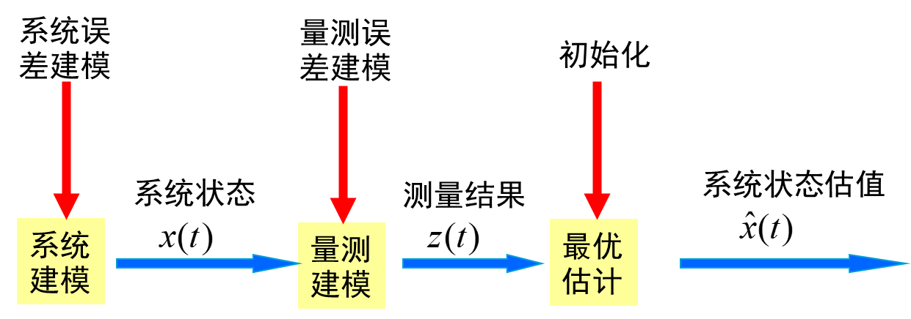
### 7. 简述多源信息融合中常用到的三种非线性滤波算法及其各自特点？
- 1. **EKF扩展KALMAN滤波**：EKF算法是基于对非线性函数的Taylor级数展开进行线性化的一阶近似算法，在一步预测和量测更新中均需计算非线性方程的Taylor级数展开系数，称为Jacobian矩阵。在EKF中这两个矩阵的展开点是不一样的，前者在上一时刻量测更新后的状态点进行展开，后者是在当前时刻一步预测的状态点进行展开。EKF是对非线性方程进行一阶近似后构建的，舍去了二阶及以上的阶次项影响，从而产生了模型误差，因此EKF算法通常都是次优的，只适用于非线性程度比较弱的情况。
- 2. **UKF无迹KALMAN滤波**：不线性化非线性状态方程和观测方程，直接利用非线性状态方程来估算状态向量的概率密度函数（pdf），规定一组确定的取样点，当状态向量的概率密度函数是高斯型的，利用这组取样点能获取高斯密度函数的均值和协方差。与EKF相比，UKF误差出现在三阶以上矩中，而EKF仅仅精确到一阶矩。
- 3. **PF算法**：PF 算法是一种基于 Bayes 递归估计的序贯蒙特卡洛模拟方法，其核心思想是利用一些随机样本，即“粒子”，来表示系统随机变量的验后概率密度，以得到基于物理模型的近似最优数值解，而不是对近似模型进行最优滤波，因而适用于强非线性非高斯噪声系统模型的滤波。Kalman 滤波是 Bayes 估计在线性条件下的实现形式，而粒子滤波是 Bayes 估计在非线性条件下的实现形式。与 EKF 和 UKF 相比，PF 不依赖于任何局部的线性化技术，也不使用任何非线性函数逼近方法
### 8. 列写离散 Kalman 滤波的完整描述方程，以及各个描述的意义？
#### 同简答题问题五
### 9. 列出小滤波周期时状态转移阵、状态噪声协方差阵离散化公式，并画出离散系统 Kalman滤波结构图？
- $ \Phi_k $状态转移矩阵
当 \( T \) 很小，\( t_{k+1} > t \geq t_k \) 时，设 \( \textbf{F}(t) \approx \textbf{F}(t_k) = \textbf{F}_k \)，因此有
\[
  \Phi_k = e^{\textbf{F}_k^T} = I + T\textbf{F}_k + \frac{1}{2!} T^2 \textbf{F}_k^2 + \cdots 
\]考虑到 \( T \) 很小，一般取前 3～5 项即可，具体取多少项可根据计算能力和精度要求进行折中设计。
- $\textbf{Q}_k$状态噪声协方差矩阵
\[
    \begin{aligned}
    \textbf{Q}_k&=\int_{t_{k}}^{t_k+1}\Phi(t_{k+1},\tau)\textbf{G}(\tau)
    \textbf{Q}(\tau)\Phi(t_{j+1},\alpha)d\tau\\
    &=\frac{T}{1!}\textbf{M}_1+\frac{T^2}{2!}\textbf{M}_2+\frac{T^3}{3!}\textbf{M}_3+\frac{T^4}{4!}\textbf{M}_4+\ ...
    \end{aligned}
\]其中，
$$
\left.
\begin{matrix}
 \textbf{M}_2=\textbf{F}_k\textbf{M}_1+(\textbf{F}_k\textbf{M}_1)^T\\
 \textbf{M}_3=\textbf{F}_k\textbf{M}_2+(\textbf{F}_k\textbf{M}_2)^T\\
 \vdots\\
 \textbf{M}_{i+1}=\textbf{F}_k\textbf{M}_i+(\textbf{F}_k\textbf{M}_i)^T
\end{matrix}
\right\}
$$

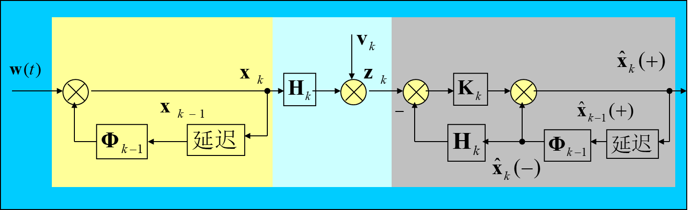
### 10. 简述滤波发散现象、引起滤波发散原因，给出几种抑制滤波发散的方法及其机理？
- 现象：随着滤波周期的增加，估计偏差越来越大
- 原因：**模型误差**、**计算误差**
- 方法：
  - 衰减记忆法：减小陈旧信息的权重，增加新信息的权重
  - 限定记忆法：只利用最新的若干信息

### 11. 画出最优估计的一般架构，简述多源信息融合中常用到的三种非线性滤波算法及其各自特点？
#### 同简答题问题六和问题七
### 12. 分布式检测融合结构分为哪几种？检测融合系统常见的融合策略有那些？
- 分布式检测融合结构：
  - 并行结构
  - 串行结构
  - 树形结构

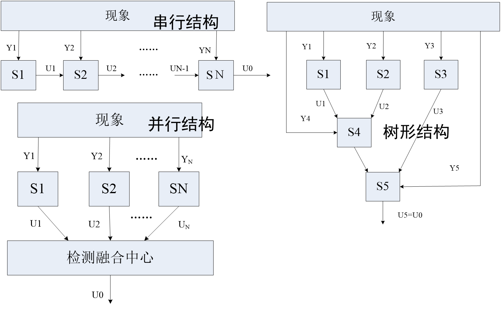

- 常见融合策略
  - “与”融合检测准则
  - “或”融合检测准则
  - 表决融合检测准则
  - 最大后验概率融合检测准则
  - Neyman-Pearson融合检测准则
  - 贝叶斯融合检测准则
  - 最小误差概率准则
### 13. 简述分布式融合检测系统二元假设检验问题，并分析二元假设检验结果的几种可能性与含义？
对于只存在两种假设$(H_0, H_1)$的检测问题，称为二元假设检验问题
对于一般的多源检测数据融合问题，数据集y可能是标量或多维向量。将数据空间划分为如下两个区域：
- $R_0$：接受区，认为假设$H_0$成立而作出决策$D_0$
- $R_1$：拒绝区，认为假设$H_1$成立而作出决策$D_1$

因此所得概率为：
\[
  P_f = P(D_1 | H_0), P_m = P(D_0 | H_1)
\]\[
  P_d = P(D_1 | H_1) = 1 - P(D_0 | H_1) = 1 - P_m
\]假设 \( p_0(y) \) 和 \( p_1(y) \) 分别为 \( H_0 \) 和 \( H_1 \) 的条件概率密度，则虚警和漏检概率分别为：
\[
  P(D_1 | H_0) = \int_{R_1} p_0(y) dy
\]\[
  P(D_0 | H_1) = \int_{R_0} p_1(y) dy
\]假设：
\[
  u_0 = 
  \begin{cases} 
  0, & \text{假设 } H_0 (\text{判定无目标}) \\ 
  1, & \text{假设 } H_1 (\text{判定有目标})
  \end{cases}
  \]
则最终结果有四种可能性：
  - 1. $H_0$为真，判决$u_0=0$  ✔
  - 2. $H_1$为真，判决$u_0=1$  ✔
  - 3. $H_0$为真，判决$u_0=1$  ❌
  - 4. $H_1$为真，判决$u_0=0$  ❌

其中：（3）为第一类错误，称为虚警，即没有目标而判决有目标；（4）为第二类错误，称为漏检，即有目标而判决没有目标。
### 14. 画出一般数据关联过程、数据关联步骤？
#### 数据关联过程， 包括三部分内容：
  1. 首先将传感器送过来的观测/点迹进行门限过滤，利用先验统计知识过滤掉那些门限以外的所不希望的观测/点迹，包括其它目标形成的真点迹和噪声、干扰形成的假点迹，限制那些不可能的观测—航迹对的形成，在该关联门的输出形成可行或有效点迹—航迹对；
  2. 然后形成关联矩阵，用以度量各个点迹与该航迹接近的程度；
  3. 最后将最接近的预测位置的点迹按赋值策略将它们分别赋予相应的航迹。

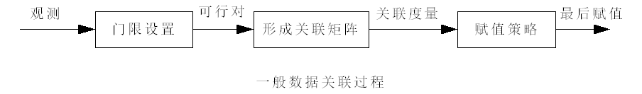
#### 数据关联步骤
  1. 查找数据库中的备选实体
  2. 把备选实体校正到观测时间
  3. 计算每个备选实体航迹的预测位置
  4. 门限过滤
  5. 计算关联矩阵
  6. 分配准则的实现

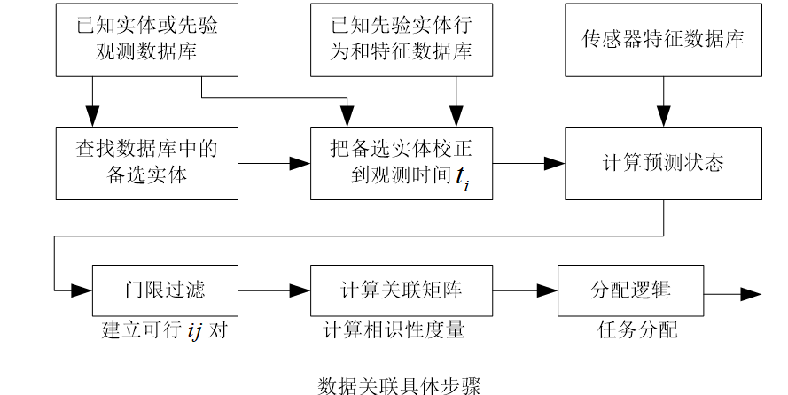
### 15. 以典型的飞行器集群、空战、防空反导、城市防空等作战为背景，简述所涉及的信息融合案例，至少包含 3 种案例分析？
1. 飞行器集群协同作战
在无人机或战斗机集群行动中，信息融合实现协同攻防。系统首先融合多源传感器数据，完成对目标的跟踪与识别（一级融合）。进而，态势评估分析集群编队关系、机动事件及敌方意图，构建敌我态势图；威胁估计则量化评估敌方集群的威胁等级，支撑指挥员进行目标分配与队形调整，实现集群自主协同。
2. 空战格斗与决策支持
空战强调实时性与高动态。系统通过融合机载雷达、预警数据，持续评估空战态势，识别敌机攻击模式与战术意图。在此基础上，威胁估计快速计算敌方飞机的即时威胁程度，为飞行员生成告警并提供最优应对策略（如规避、干扰或反击），从而在瞬息万变的空战中抢占先机。
3. 防空反导与城市防空
在保护要地的场景中，信息融合用于整合地面雷达、卫星、预警机等多维信息。态势评估综合地形、气象、目标类型（如巡航导弹、无人机），生成覆盖全区域的综合防空态势图；威胁估计则预测来袭武器的轨迹与落点，识别我方薄弱环节，并优化分配拦截火力与电子对抗资源，以达成高效防御。
## 四、综合分析题
### 1、理解透教材例题 4-7、题 5-3、题 6-8，尤其是后两题，参考该例题，能做到修改题目条件，写出状态方程、观测方程，以及根据条件写出关键步骤的 Matlab 代码

#### 例4-7
p105
##### 1. 系统模型

程序首先模拟了一个一阶线性动态系统，其行为可以通过一个离散时间的状态空间模型来描述。

###### 1.1. 状态方程

状态方程描述了系统真实状态 $x_k$ 如何随时间演变。
**公式:**
$$
x_k = \Phi x_{k-1} + w_{k-1}
$$ **参数说明:**
-   $x_k$: 在离散时间点 $k$ 的系统真实状态（一个标量）。
-   $\Phi$: 状态转移矩阵，描述系统从一个状态到下一个状态的内在动态。在此程序中，它由连续系统参数离散化得到：
    $$ \Phi = e^{-aT} $$
-   $w_{k-1}$: 过程噪声，代表了模型中未考虑到的不确定性或扰动。它被假设为一个均值为零的高斯白噪声序列，其方差为 $Q$。
    $$ w_k \sim N(0, Q) $$
-   $Q$: 过程噪声协方差（此处为方差），计算公式为：
    $$ Q = k(1 - e^{-2aT}) $$
**对应的 Matlab 代码:**
```matlab
% ========== 参数设置 ==========
T = 0.1;        % 采样时间间隔
a = 2e-4;       % 系统参数（衰减系数）
k = 0.5;        % 系统参数（增益系数）

% ========== 状态方程参数计算 ==========
phik = exp(-a*T);           % 状态转移矩阵 (Φ)
Cx = k*(1-exp(-2*a*T));     % 过程噪声的方差 (Q)
qk = sqrt(Cx);              % 过程噪声的标准差

% ========== 生成过程噪声 ==========
wn = randn(N,1);            % 生成标准正态分布随机数
Wk = qk * wn;               % 生成过程噪声序列 (w)

% ========== 生成真实状态序列 ==========
xk = zeros(N,1);            % 初始化状态向量
xk(1,1) = Wk(1,1);          % 初始状态
for i = 2:N
    % 状态更新方程的实现
    xk(i,1) = phik * xk(i-1,1) + Wk(i,1);
end
```

###### 1.2. 观测方程
观测方程描述了传感器如何测量系统状态。该系统使用两个独立的传感器来观测同一个状态 $x_k$。
**公式:**
$$
\mathbf{z}_k = H x_k + \mathbf{v}_k
$$**参数说明:**
-   $\mathbf{z}_k$: 在时间点 $k$ 的观测向量，它是一个 $2 \times 1$ 的向量，包含了两个传感器的读数。
    $$
    \mathbf{z}_k = \begin{bmatrix} z_{k,1} \\ z_{k,2} \end{bmatrix}
    $$
-   $H$: 观测矩阵，建立了状态与观测之间的关系。由于两个传感器都直接测量状态 $x_k$，所以：
    $$
    H = \begin{bmatrix} 1 \\ 1 \end{bmatrix}
    $$
-   $\mathbf{v}_k$: 测量噪声向量，代表了传感器测量过程中的不精确性。假设噪声是均值为零的高斯白噪声。
    $$
    \mathbf{v}_k \sim N(\mathbf{0}, R)
    $$
-   $R$: 测量噪声协方差矩阵。由于两个传感器的噪声是相互独立的， $R$ 是一个对角矩阵：
    $$
    R = \begin{bmatrix} r_{k1}^2 & 0 \\ 0 & r_{k2}^2 \end{bmatrix}
    $$
    其中 $r_{k1}$ 和 $r_{k2}$ 分别是两个传感器测量噪声的标准差。

**对应的 Matlab 代码:**
```matlab
% ========== 参数设置 ==========
rk1 = 0.1;      % 传感器1的测量噪声标准差
rk2 = 1;        % 传感器2的测量噪声标准差

% ========== 生成传感器1的观测数据 ==========
vn = randn(N,1);
vk1 = rk1 * vn;             % 传感器1的测量噪声 (v1)
zk1 = xk + vk1;             % 传感器1的观测值 (z1)

% ========== 生成传感器2的观测数据 ==========
vn = randn(N,1);
vk2 = rk2 * vn;             % 传感器2的测量噪声 (v2)
zk2 = xk + vk2;             % 传感器2的观测值 (z2)

% ========== 估计器参数设置 ==========
h = [1; 1];                 % 观测矩阵 H
R = [rk1^2 0; 0 rk2^2];     % 测量噪声协方差矩阵 R
zk = [zk1, zk2];            % 组合成观测向量 z_k
```
##### 2. 估计算法关键步骤
程序实现了两种递推估计算法，用于从带噪声的观测值 `zk` 中估计出真实状态 `xk`。
###### 2.1. 加权递推最小二乘估计
该算法通过递推方式更新状态估计值，每一步都利用新的观测数据来修正上一时刻的估计。它没有考虑系统的动态模型（即状态转移矩阵 $\Phi$ 和过程噪声 $Q$）。
**递推公式:**
令 $\hat{x}_i$ 为第 $i$ 次迭代的估计值， $P_i$ 为对应的估计误差协方差。
1.  **更新估计误差协方差 $P_i$:**
    $$
    P_i = \left( P_{i-1}^{-1} + H^T W H \right)^{-1}
    $$
2.  **更新状态估计 $\hat{x}_i$:**
    $$
    \hat{x}_i = \hat{x}_{i-1} + K_i (\mathbf{z}_i - H \hat{x}_{i-1})
    $$
    其中增益矩阵 $K_i = P_i H^T W$。

在程序中，由于状态是标量，$P_i$ 也是标量，因此 $P_i^{-1}$ 写为 `1/p`。权重矩阵 $W$ 使用了测量噪声协方差的逆，即 $W = R^{-1}$。
**对应的 Matlab 代码:**
```matlab
% ========== 加权递推最小二乘估计 ==========
wk = inv(R);                % 权重矩阵 W = R^{-1}
x_est_wls(1,1) = 0;         % 初始化状态估计
p_est_wls(1) = 1e6;         % 初始化估计误差协方差 P

% ... (第一步手动更新) ...

% 循环进行递推估计
for i = 2:N
    % 更新估计误差协方差 P_i = (P_{i-1}^{-1} + H' * W * H)^{-1}
    p_est_wls(i) = 1/(1/p_est_wls(i-1) + h' * wk * h);
    % 更新状态估计值 x_i = x_{i-1} + P_i * H' * W * (z_i - H*x_{i-1})
    x_est_wls(i,1) = x_est_wls(i-1,1) + p_est_wls(i) * h' * wk * (zk(i,:)' - h * x_est_wls(i-1,1));
end
```
###### 2.2. 最小方差估计（递推形式）
这个算法与加权递推最小二乘法非常相似，但其公式形式更接近于贝叶斯估计或卡尔曼滤波的更新步骤。它同样没有使用系统的动态模型进行“预测”，而是直接在每个时间步进行“更新”。
**递推公式:**
该算法的数学形式与 WLS 相同，但明确使用了 $R^{-1}$ 作为权重。
1.  **更新估计误差协方差 $P_i$:**
    $$
    P_i = \left( P_{i-1}^{-1} + H^T R^{-1} H \right)^{-1}
    $$
2.  **更新状态估计 $\hat{x}_i$:**
    $$
    \hat{x}_i = \hat{x}_{i-1} + K_i (\mathbf{z}_i - H \hat{x}_{i-1})
    $$
    其中增益矩阵 $K_i = P_i H^T R^{-1}$。

**注意**: 在一个完整的卡尔曼滤波器中，每一步都包含一个“预测”步骤（使用状态方程）和一个“更新”步骤（使用观测方程）。此处的两种算法都只实现了“更新”步骤的递推形式。

**对应的 Matlab 代码:**
```matlab
% ========== 最小方差估计（方法2：递推形式） ==========
R_inv = inv(R);             % 测量噪声协方差矩阵的逆 R^{-1}
x_est_mv1(1,1) = 0;         % 初始化状态估计
p_est_mv1(1) = 1e6;         % 初始化估计误差协方差 P

% ... (第一步手动更新) ...

% 循环进行递推估计
for i = 2:N
    % 更新估计误差协方差 P_i = (P_{i-1}^{-1} + H' * R^{-1} * H)^{-1}
    p_est_mv1(i) = inv(inv(p_est_mv1(i-1)) + h' * R_inv * h);
    % 更新状态估计值 x_i = x_{i-1} + P_i * H' * R^{-1} * (z_i - H*x_{i-1})
    x_est_mv1(i,1) = x_est_mv1(i-1,1) + p_est_mv1(i) * h' * R_inv * (zk(i,:)' - h * x_est_mv1(i-1,1));
end
```
**总代码**
```matlab
clear all;      % 清除工作区中的所有变量
close all;      % 关闭所有图形窗口

% ========== 参数设置 ==========
T = 0.1;        % 采样时间间隔
a = 2e-4;       % 系统参数（衰减系数）
k = 0.5;        % 系统参数（增益系数）
rk1 = 0.1;      % 传感器1的测量噪声标准差
rk2 = 1;        % 传感器2的测量噪声标准差
N = 1000;       % 总采样点数

% ========== 状态方程参数计算 ==========
phik = exp(-a*T);           % 状态转移矩阵（离散时间系统）
Cx = k*(1-exp(-2*a*T));     % 过程噪声的方差
qk = sqrt(Cx);              % 过程噪声的标准差

% ========== 生成过程噪声 ==========
wn = randn(N,1);            % 生成N个标准正态分布的随机数
Wk = qk * wn;               % 生成过程噪声序列

% ========== 生成真实状态序列 ==========
xk = zeros(N,1);            % 初始化状态向量
xk(1,1) = Wk(1,1);          % 初始状态（第一个状态值）
for i = 2:N
    % 状态更新：x(k) = phi * x(k-1) + w(k)
    xk(i,1) = phik * xk(i-1,1) + Wk(i,1);
end

% ========== 生成传感器1的观测数据 ==========
vn = randn(N,1);            % 生成新的标准正态分布随机数
vk1 = rk1 * vn;             % 传感器1的测量噪声
zk1 = xk + vk1;             % 传感器1的观测值（真实状态+噪声）

% ========== 生成传感器2的观测数据 ==========
vn = randn(N,1);            % 再次生成标准正态分布随机数
vk2 = rk2 * vn;             % 传感器2的测量噪声
zk2 = xk + vk2;             % 传感器2的观测值（真实状态+噪声）

% ========== 估计器参数设置 ==========
h = [1; 1];                 % 观测矩阵（两个传感器对同一状态的观测）
R = [rk1^2 0; 0 rk2^2];     % 测量噪声协方差矩阵（对角矩阵）
zk = [zk1, zk2];            % 组合两个传感器的观测数据
R_inv = inv(R);             % 测量噪声协方差矩阵的逆

% ========== 加权递推最小二乘估计 ==========
wk = R_inv;                 % 权重矩阵（使用噪声协方差逆矩阵）
x_est_wls(1,1) = 0;         % 初始化加权最小二乘估计值
p_est_wls(1) = 1e6;         % 初始化估计误差协方差（设置较大初始值）
% 第一步更新：计算初始时刻的后验估计和协方差
p_est_wls(1) = 1/(1/p_est_wls(1) + h' * wk * h);
x_est_wls(1,1) = x_est_wls(1,1) + p_est_wls(1) * h' * wk * (zk(1,:)' - h * x_est_wls(1,1));

% 循环进行递推估计
for i = 2:N
    % 更新估计误差协方差
    p_est_wls(i) = 1/(1/p_est_wls(i-1) + h' * wk * h);
    % 更新状态估计值
    x_est_wls(i,1) = x_est_wls(i-1,1) + p_est_wls(i) * h' * wk * (zk(i,:)' - h * x_est_wls(i-1,1));
end

% ========== 最小方差估计（方法1：直接计算） ==========
% 计算最小方差估计的增益矩阵
Kk = Cx * h' * inv(h * Cx * h' + R);
% 对每个时刻进行最小方差估计
for i = 1:N
    x_est_mv(i,1) = Kk * zk(i,:)';    % 使用固定增益进行估计
end

% ========== 最小方差估计（方法2：递推形式） ==========
x_est_mv1(1,1) = 0;         % 初始化最小方差估计值
p_est_mv1(1) = 1e6;         % 初始化估计误差协方差
% 第一步更新：计算初始时刻的后验估计和协方差
p_est_mv1(1) = 1/(1/Cx + h' * R_inv * h);
x_est_mv1(1,1) = x_est_mv1(1,1) + p_est_mv1(1) * h' * R_inv * (zk(1,:)' - h * x_est_mv1(1,1));

% 循环进行递推估计
for i = 2:N
    % 更新估计误差协方差（使用矩阵求逆）
    p_est_mv1(i) = inv(inv(p_est_mv1(i-1)) + h' * R_inv * h);
    % 更新状态估计值
    x_est_mv1(i,1) = x_est_mv1(i-1,1) + p_est_mv1(i) * h' * R_inv * (zk(i,:)' - h * x_est_mv1(i-1,1));
end

% ========== 结果可视化 ==========
t = (0:N-1) * T;    % 生成时间向量

% 图1：状态估计结果对比
figure(1)
plot(t, xk, 'b-', t, x_est_wls, 'r*-', t, x_est_mv1, 'ko-');
xlabel('时间(s)'); ylabel('估计值');
legend('真值', '加权递推最小二乘估计', '最小方差估计');
title('状态估计结果对比');

% 图2：估计误差对比
figure(2)
plot(t, x_est_wls - xk, 'r*-', t, x_est_mv1 - xk, 'ko-');
xlabel('时间(s)'); ylabel('估计偏差');
legend('加权递推最小二乘估计误差', '最小方差估计误差');
title('估计误差对比');

% 图3：估计误差协方差对比
figure(3)
plot(t, p_est_wls, 'r*-', t, p_est_mv1, 'ko-');
xlabel('时间(s)'); ylabel('P');
legend('加权递推最小二乘估计', '最小方差估计');
title('估计误差协方差对比');
```
#### 例5-3
p127
**标准卡尔曼滤波器 (α-β-γ 滤波器) Matlab 程序分析**
该文档对一个标准的卡尔曼滤波器 Matlab 程序进行详细的分析和拆解。该程序用于跟踪一个具有随机加速度的目标，因此也被称为 α-β-γ 滤波器。
##### 1. 系统模型
程序模拟了一个基于恒定加速度（Constant Acceleration, CA）运动学的目标。该系统可以用一个线性的离散时间状态空间模型来描述。
###### 1.1. 状态方程
状态方程描述了目标的运动状态（位置、速度、加速度）如何从一个时间步演变到下一个时间步。
**公式:**
$$
\mathbf{x}_k = \Phi \mathbf{x}_{k-1} + \mathbf{w}_{k-1}
$$**参数说明:**
* **状态向量 $\mathbf{x}_k$**:
    $$
    \mathbf{x}_k = \begin{bmatrix} \text{位置} \\ \text{速度} \\ \text{加速度} \end{bmatrix}_k
    $$
* **状态转移矩阵 $\Phi$**: 该矩阵基于牛顿运动学定律，其中 $T$ 是采样间隔。
    $$
    \Phi = \begin{bmatrix} 1 & T & \frac{1}{2}T^2 \\ 0 & 1 & T \\ 0 & 0 & 1 \end{bmatrix}
    $$
* **过程噪声 $\mathbf{w}_{k-1}$**: 代表了模型的不确定性。程序假设目标的“加加速度”（jerk）是白噪声，其影响通过噪声驱动矩阵 $G$ 施加到加速度上。过程噪声的协方差矩阵 $Q_m$ 计算如下：
    $$
    Q_m = G Q G^T = \begin{bmatrix} 0 \\ 0 \\ T \end{bmatrix} Q \begin{bmatrix} 0 & 0 & T \end{bmatrix} = \begin{bmatrix} 0 & 0 & 0 \\ 0 & 0 & 0 \\ 0 & 0 & T^2 Q \end{bmatrix}
    $$
    其中 $Q$ 是加加速度噪声的标量方差。

**对应的 Matlab 代码:**
```matlab
T = 0.2;        % 采样间隔时间
Phi = [1 T  0.5*T^2; 0 1 T; 0 0 1];
G = [0 0 T]';
Q = 0.1;        % 过程噪声方差
```
###### 1.2. 观测方程
观测方程描述了传感器如何对系统状态进行测量。在本例中，传感器只能观测到目标的位置。
**公式:**
$$
\mathbf{z}_k = H \mathbf{x}_k + \mathbf{v}_k
$$
**参数说明:**
* **观测值 $\mathbf{z}_k$**: 传感器在时间点 $k$ 的读数（标量）。
* **观测矩阵 $H$**: 将状态向量映射到观测空间。
    $$
    H_k = H = \begin{bmatrix} 1 & 0 & 0 \end{bmatrix}
    $$
* **测量噪声 $\mathbf{v}_k$**: 代表传感器测量的不精确性，假设为高斯白噪声，其方差为 $R$。

**对应的 Matlab 代码:**
```matlab
H = [1 0 0];
R = 0.04;       % 观测噪声方差
```
##### 2. 卡尔曼滤波算法关键步骤
卡尔曼滤波是一个递归的过程，包含两个主要步骤：**时间更新（预测）** 和 **量测更新（校正）**。
### 初始化

在主循环开始之前，需要初始化状态估计值 $\hat{\mathbf{x}}_{0|0}$ 和估计误差协方差矩阵 $P_{0|0}$。

```matlab
xe(:,1) = zeros(3,1);   % 初始状态估计值 (x_hat_0|0)
Ppos = eye(3);          % 初始后验估计误差协方差 (P_0|0)
```
### 主循环 (`for i = 2:100`)
#### 2.1. 时间更新（预测）
此步骤使用系统模型将上一时刻的状态估计和协方差预测到当前时刻，得到“先验”估计。
1.  **状态预测**:
    $$
    \hat{\mathbf{x}}_{k|k-1} = \Phi \hat{\mathbf{x}}_{k-1|k-1}
    $$
    `k|k-1` 表示在已知直到 $k-1$ 时刻的观测数据的情况下，对 $k$ 时刻状态的预测。

    ```matlab
    % 状态预测 (x_hat_k|k-1)
    x(:,i) = Phi * xe(:,i-1);
    ```

2.  **协方差预测**:
    $$
    P_{k|k-1} = \Phi P_{k-1|k-1} \Phi^T + G Q G^T
    $$
    预测误差协方差 $P$ 包含了来自上一时刻的不确定性以及过程噪声引入的新的不确定性。

    ```matlab
    % 协方差预测 (P_k|k-1)
    Pneg = Phi * Ppos * Phi' + G * Q * G';
    ```

#### 2.2. 量测更新（校正）

此步骤使用当前时刻的实际观测值 $\mathbf{z}_k$ 来校正预测步骤得到的先验估计，从而获得更准确的“后验”估计。

1.  **计算卡尔曼增益 $K_k$**:
    $$
    K_k = P_{k|k-1} H^T (H P_{k|k-1} H^T + R)^{-1}
    $$
    卡尔曼增益决定了在多大程度上相信“预测值”和“观测值”。它的值权衡了预测误差协方差和测量噪声方差。

    ```matlab
    % 计算Kalman增益 K_k
    K(:,i) = Pneg * H' * inv(H * Pneg * H' + R);
    ```

2.  **状态估计更新**:
    $$
    \hat{\mathbf{x}}_{k|k} = \hat{\mathbf{x}}_{k|k-1} + K_k (\mathbf{z}_k - H \hat{\mathbf{x}}_{k|k-1})
    $$
    最终的估计值是预测值加上一个由观测残差 $(\mathbf{z}_k - H \hat{\mathbf{x}}_{k|k-1})$ 加权的修正项。

    ```matlab
    % 状态估计值更新 (x_hat_k|k)
    xe(:,i) = x(:,i) + K(:,i) * (z(:,i) - H * x(:,i));
    ```

3.  **协方差更新**:
    $$
    P_{k|k} = (I - K_k H) P_{k|k-1} (I - K_k H)^T + K_k R K_k^T
    $$
    这是更新后验误差协方差的 Joseph 稳定形式，它在数值计算上比简单形式 $P_{k|k} = (I - K_k H) P_{k|k-1}$ 更稳定。

    ```matlab
    % 更新后验协方差 (P_k|k)
    Ppos = (I - K(:,i) * H) * Pneg * (I - K(:,i) * H)' + K(:,i) * R * K(:,i)';
    ```
这个循环不断地进行“预测-校正”，从而对目标的运动状态进行实时跟踪和估计。


**总程序**
```matlab
% 一个标准的Kalman滤波器
% alpha-beta-gama滤波（针对位置、速度、加速度的三状态滤波器）
% 系统模型 x[k+1] = Phi * x[k] + G * w[k]
% 量测模型 z[k] = H * x[k] + v[k]

clear all;      % 清除工作区所有变量
close all;      % 关闭所有图形窗口

% ========== 系统参数设置 ==========
T = 0.2;        % 采样间隔时间

% 状态转移矩阵（针对匀加速运动模型）
% 状态向量 x = [位置; 速度; 加速度]
Phi = [1 T  0.5*T^2; 0 1 T; 0 0 1];

% 过程噪声驱动矩阵（假设只有加速度受噪声影响）
G = [0 0 T]';   % 加加速度为白噪声

% 观测矩阵（只对位置进行测量）
H = [1 0 0];

% ========== 噪声方差阵以及初值设置 ==========
Q = 0.1;        % 过程噪声方差
R = 0.04;       % 观测噪声方差
I = eye(3);     % 3x3单位矩阵

% 初始化状态向量
xr(:,1) = randn(3,1);   % 假设状态真实值（随机初始状态）
xe(:,1) = zeros(3,1);   % 初始状态估计值（设为0）

% 初始化协方差矩阵
Ppos = eye(3);          % 初始后验估计误差协方差
Ppre(:,1) = diag(Ppos); % 存储先验协方差对角元素
Pest(:,1) = diag(Ppos); % 存储后验协方差对角元素

% ========== 主循环：Kalman滤波过程 ==========
for i = 2:100
    % ----- 状态预测（时间更新） -----
    x(:,i) = Phi * xe(:,i-1);                    % 状态预测
    Pneg = Phi * Ppos * Phi' + G * Q * G';       % 协方差预测
    Ppre(:,i) = diag(Pneg);                      % 提取对角元素用于绘图
    
    % ----- 过程噪声附加（模拟真实系统） -----
    w = Q^0.5 * randn;                           % 生成过程噪声
    xr(:,i) = Phi * xr(:,i-1) + G * w;           % 实际状态值（含噪声）
    
    % ----- 量测噪声附加 -----
    v = Q^0.5 * randn;                           % 生成观测噪声
    z(:,i) = H * xr(:,i) + v;                    % 生成量测值
    
    % ----- 滤波计算（量测更新）过程 -----
    K(:,i) = Pneg * H' * inv(H * Pneg * H' + R); % 计算Kalman增益
    % 更新后验协方差（使用更稳定的Joseph形式）
    Ppos = (I - K(:,i) * H) * Pneg * (I - K(:,i) * H)' + K(:,i) * R * K(:,i)';
    Pest(:,i) = diag(Ppos);                      % 提取对角元素用于绘图
    xe(:,i) = x(:,i) + K(:,i) * (z(:,i) - H * x(:,i)); % 状态估计值更新
end

% ========== 稳态Kalman滤波器 ==========
% 计算稳态增益（当协方差矩阵收敛时的增益）
Ks = Ppos * H' * 1 / R;                          % 稳态Kalman增益
xe1(:,1) = zeros(3,1);                           % 初始化稳态滤波器状态

% 使用稳态增益进行滤波
for i = 2:100
    xe1(:,i) = Phi * xe1(:,i-1) + Ks * (z(:,i) - H * Phi * xe1(:,i-1));
end

% ========== 结果可视化 ==========
t = T * (1:100);     % 生成时间向量

% 图1：位移估计误差对比
figure(1);
plot(t, abs(x(1,:) - xr(1,:)), 'k', ...         % 预测值误差
     t, abs(xe(1,:) - xr(1,:)), 'ro-', ...      % Kalman滤波误差
     t, abs(xe1(1,:) - xr(1,:)), 'b*-');        % 稳态增益滤波误差
legend('预测值误差', '滤波误差', '稳态增益滤波误差');
xlabel('时间'), ylabel('位移估计误差');

% 图2：速度估计误差对比
figure(2)
plot(t, abs(x(2,:) - xr(2,:)), 'k', ...         % 预测误差
     t, abs(xe(2,:) - xr(2,:)), 'ro-', ...      % Kalman滤波误差
     t, abs(xe1(2,:) - xr(2,:)), 'b*-');        % 稳态增益滤波误差
legend('预测误差', '滤波误差', '稳态增益滤波误差');
xlabel('时间'), ylabel('速度估计误差');

% 图3：加速度估计误差对比
figure(3)
plot(t, abs(x(3,:) - xr(3,:)), 'k', ...         % 预测误差
     t, abs(xe(3,:) - xr(3,:)), 'ro-', ...      % Kalman滤波误差
     t, abs(xe1(3,:) - xr(3,:)), 'b*-');        % 稳态增益滤波误差
legend('预测误差', '滤波误差', '稳态增益滤波误差');
xlabel('时间'), ylabel('加速度估计误差');

% 图4：协方差矩阵对角线元素变化
figure(4);
plot(t, Ppre(1,:), 'k*--', ...                  % 先验位置方差
     t, Ppre(2,:), 'ko--', ...                  % 先验速度方差
     t, Ppre(3,:), 'k--', ...                   % 先验加速度方差
     t, Pest(1,:), 'ks-', ...                   % 后验位置方差
     t, Pest(2,:), 'kv-', ...                   % 后验速度方差
     t, Pest(3,:), 'k-');                       % 后验加速度方差
legend('p11(-)', 'p22(-)', 'p33(-)', 'p11(+)', 'p22(+)', 'p33(+)');
xlabel('时间'); ylabel('P阵对角线元素');

% 图5：Kalman增益变化过程
figure(5)
plot(t, K(1,:), 'k-', ...                       % 位移增益
     t, K(2,:), 'k*-', ...                      % 速度增益
     t, K(3,:), 'kv-');                         % 加速度增益
legend('位移增益', '速度增益', '加速度增益');
xlabel('时间'); ylabel('滤波增益');

% ========== 结果的简单说明 ==========
% 系统实际上是由白噪声（加加速度）驱动，其中加速度就表现为随机游走特性
% 本例中P阵实际上提取了估计误差阵Ppos的对角线元素
% 这是一个典型的α-β-γ滤波器，用于跟踪具有随机加速度的目标
```
# 例6-8

---

#### 1. 符号说明
- $s_k$：位置（位移）
- $v_k$：速度
- $a_k$：加速度
- $j_k$：加加速度（jerk），在扩维模型中作为一阶 Markov 过程（有色噪声）
- 采样间隔：`T`
- Markov 衰减系数：`exp(-a*T)`，其中 `a` 为 Markov 的时间常数
- 过程噪声方差：`Q`
- 测量噪声方差：`R`
- 观测只测量位置：$z_k = H x_k + v_k$

---

#### 2. 扩维 4 状态模型（有色噪声）

##### 状态向量
$$
x_k = \begin{bmatrix} s_k \\ v_k \\ a_k \\ j_k \end{bmatrix}
$$

**对应 MATLAB 代码**
```matlab
% 状态向量在 MATLAB 中使用列向量表示，例如：
% x = [s; v; a; j];
```

##### 状态转移方程
$$
x_{k+1} = \Phi\, x_k + \Gamma \, w_k
$$
其中
$$
\Phi =
\begin{bmatrix}
1 & T & \tfrac{T^2}{2} & \tfrac{T^3}{6} \\
0 & 1 & T & \tfrac{T^2}{2} \\
0 & 0 & 1 & T \\
0 & 0 & 0 & e^{-aT}
\end{bmatrix}, \qquad
\Gamma = \begin{bmatrix}0\\0\\0\\1\end{bmatrix}.
$$

**对应 MATLAB 代码**
```matlab
Phi = [1, T,  0.5*T^2,  (1/6)*T^3;
       0, 1,      T,    0.5*T^2;
       0, 0,      1,        T;
       0, 0,      0,   exp(-a*T)];
Gamma = [0;0;0;1];
```

##### 有色噪声（过程噪声）模型（AR(1)）
$$
w_{k+1} = e^{-aT} w_k + \sigma \sqrt{1-e^{-2aT}}\,\varepsilon_k,\quad \varepsilon_k\sim\mathcal{N}(0,1),
$$
其中 \(\sigma=\sqrt{Q}\)。

**对应 MATLAB 代码**
```matlab
sigma = sqrt(Q);
eps_seq = randn(N,1);
w = zeros(N,1);
w(1) = sigma * eps_seq(1);
for k = 2:N
    w(k) = exp(-a*T) * w(k-1) + sigma*sqrt(1-exp(-2*a*T)) * eps_seq(k);
end
```

##### 观测方程
$$
z_k = H x_k + v_k,\qquad H = \begin{bmatrix}1 & 0 & 0 & 0\end{bmatrix},
$$
\(v_k\sim\mathcal{N}(0,R)\)。

**对应 MATLAB 代码**
```matlab
H = [1 0 0 0];
v = sqrt(R) * randn(N,1);
z(k) = H * xr(:,k) + v(k);
```

---

#### 3. 标准 3 状态模型（把加加速度近似为白噪声）

##### 状态向量
$$
x^{(1)}_k = \begin{bmatrix} s_k \\ v_k \\ a_k \end{bmatrix}
$$

**对应 MATLAB 代码**
```matlab
% x1 = [s; v; a];
```

##### 状态转移矩阵
$$
\Phi_1 =
\begin{bmatrix}
1 & T & \tfrac{T^2}{2}\\
0 & 1 & T\\
0 & 0 & 1
\end{bmatrix}
$$

**对应 MATLAB 代码**
```matlab
Phi1 = Phi(1:3,1:3);  % 或者直接写出矩阵
% Phi1 = [1, T, 0.5*T^2; 0, 1, T; 0, 0, 1];
```

##### 过程噪声驱动矩阵（常见离散化）
若把白噪声直接作用在加速度分量（物理一致的离散化），常用：
$$
G_1 = \begin{bmatrix} \tfrac{T^2}{2} \\ T \\ 1 \end{bmatrix}
$$
（图片中有时使用近似 `G1=[0;0;T]`，两者会给出不同的协方差传播结果。）

**对应 MATLAB 代码**
```matlab
G1 = [ (T^2)/2; T; 1 ];   % 推荐
% 或者按图片中的简化近似： G1 = [0;0;T];
```

##### 观测方程
$$
z_k = H_1 x^{(1)}_k + v_k,\qquad H_1 = \begin{bmatrix}1 & 0 & 0\end{bmatrix}
$$

**对应 MATLAB 代码**
```matlab
H1 = [1 0 0];
```

---

#### 4. 卡尔曼滤波的关键步骤（通用形式）

##### 预测（时间更新）
状态预测：
$$
\hat{x}_{k|k-1} = \Phi \, \hat{x}_{k-1|k-1}
$$
协方差预测：
$$
P_{k|k-1} = \Phi \, P_{k-1|k-1} \, \Phi^\top + \Gamma \, Q \, \Gamma^\top
$$

**对应 MATLAB 代码**
```matlab
xpred = Phi * xe(:,k-1);
Pneg = Phi * Ppos * Phi' + Gamma * Q * Gamma';
```

对于 3 状态模型：
```matlab
xpred1 = Phi1 * xe1(:,k-1);
Pneg1 = Phi1 * Ppos1 * Phi1' + G1 * Q * G1';
```

##### 计算卡尔曼增益
$$
K_k = P_{k|k-1} H^\top ( H P_{k|k-1} H^\top + R )^{-1}
$$

**对应 MATLAB 代码**
```matlab
S = H * Pneg * H' + R;
K = Pneg * H' / S;
```

##### 更新（测量更新）
状态更新：
$$
\hat{x}_{k|k} = \hat{x}_{k|k-1} + K_k ( z_k - H \hat{x}_{k|k-1} )
$$
协方差更新：
$$
P_{k|k} = (I - K_k H) P_{k|k-1}
$$

**对应 MATLAB 代码**
```matlab
xe(:,k) = xpred + K * ( z(k) - H * xpred );
Ppos = (eye(4) - K * H) * Pneg;
```

对于 3 状态模型类似：
```matlab
xe1(:,k) = xpred1 + K1 * ( z(k) - H1 * xpred1 );
Ppos1 = (eye(3) - K1 * H1) * Pneg1;
```

---

#### 5. 生成真实系统并仿真（关键 MATLAB 片段）

**生成真实状态与观测**
```matlab
xr = zeros(4,N);
xr(:,1) = zeros(4,1);
xr(4,1) = w(1);
z = zeros(1,N);
z(1) = H * xr(:,1) + v(1);
for k = 2:N
    xr(:,k) = Phi * xr(:,k-1) + Gamma * w(k);
    z(k) = H * xr(:,k) + v(k);
end
```

---
#### 8. 说明与注意事项
- 上文中 `Gamma * Q * Gamma'` 表示过程噪声协方差项：我们用标量 `Q`（即 `w` 的方差）并假定噪声直接作用在 `j` 分量上。
- 若你希望严格按图片中的 `G1 = [0;0;T]` 来运行 3 状态模型，只需把 `G1` 替换为该向量即可；但请注意这会改变离散化下的误差传播特性。
- 若需要我把这个 Markdown 文件导出为 `.md` 文件或把 MATLAB 脚本打包成 `.m` 下载链接，请回复 “生成文件”，我会把文件准备好并提供下载链接。

---

**主程序**
```matlab
% 有色噪声Kalman滤波器
% 假设alpha-beta-gama滤波中的加加速度非白噪声而为一阶Markov过程
% 进行状态扩维后滤波程序如下
% alpha-beta-gama滤波
% 系统模型 x[k+1] = Phi * x[k] + WN[k]
% 噪声模型 WN[k+1] = exp(-a*T)WN[k] + sigma*sqrt(1-exp(-2*a*T))*w[k]
% 量测模型 z[k] = H * x[k] + v[k]

clear all;  % 清除工作区所有变量
close all;  % 关闭所有图形窗口
clc         % 清空命令窗口

% ========== 系统参数设置 ==========
T = 0.2;    % 采样间隔时间

% 噪声方差阵以及初值设置
Q = 0.9;                    % 过程噪声方差
sigma = sqrt(Q);            % 过程噪声标准差
R = 0.6;                    % 观测噪声方差
I = eye(4);                 % 4x4单位矩阵
N = 200;                    % 总采样点数
a = 0.11;                   % Markov过程的时间常数

% ========== 生成噪声序列 ==========
w = sigma * sqrt(1 - exp(-2*a*T)) * randn(N,1);  % 生成过程噪声序列
v = R^0.5 * randn(N,1);                          % 生成观测噪声序列

% ========== 扩维后的系统模型 ==========
% 状态转移矩阵（扩维到4维：位置、速度、加速度、加加速度）
% 加加速度建模为一阶Markov过程
Phi = [1 T  0.5*T^2 1/6*T^3; 0 1 T 0.5*T^2; 0 0 1 T; 0 0 0 exp(-a*T)];
G = [0 0 0 1]';             % 噪声驱动矩阵
H = [1 0 0 0];              % 观测矩阵（只对位置进行测量）

% ========== 生成真实状态序列 ==========
xr(:,1) = zeros(4,1);       % 初始化真实状态
xr(4,1) = w(1,1);           % 初始加加速度值
for i = 2:N
    xr(:,i) = Phi * xr(:,i-1) + G * w(i,1);  % 状态更新（含过程噪声）
    z(:,i) = H * xr(:,i) + v(i,1);           % 生成观测值（含观测噪声）
end

% ========== 扩维Kalman滤波器初始化 ==========
xe(:,1) = zeros(4,1);       % 初始状态估计值
Ppos = eye(4);              % 初始后验估计误差协方差
Ppre(:,1) = diag(Ppos);     % 存储先验协方差对角元素
Pest(:,1) = diag(Ppos);     % 存储后验协方差对角元素

% ========== 扩维Kalman滤波主循环 ==========
for i = 2:N
    % ----- 状态预测（时间更新） -----
    x(:,i) = Phi * xe(:,i-1);                    % 状态预测
    Pneg = Phi * Ppos * Phi' + G * Q * G';       % 协方差预测
    Ppre(:,i) = diag(Pneg);                      % 提取对角元素
    
    % ----- 滤波计算（量测更新）过程 -----
    K(:,i) = Pneg * H' * inv(H * Pneg * H' + R); % 计算Kalman增益
    Ppos = (I - K(:,i) * H) * Pneg;              % 更新后验协方差
    Pest(:,i) = diag(Ppos);                      % 提取对角元素
    xe(:,i) = x(:,i) + K(:,i) * (z(:,i) - H * x(:,i)); % 状态估计值更新
end

% ========== 标准Kalman滤波器（将有色噪声近似为白噪声） ==========
% 使用3状态模型，假设加加速度为白噪声
Phi1 = Phi(1:3,1:3);        % 提取前3x3状态转移矩阵
G1 = [0 0 T]';              % 噪声驱动矩阵
H1 = [1 0 0];               % 观测矩阵
I1 = eye(3);                % 3x3单位矩阵

% 标准Kalman滤波器初始化
xe1(:,1) = zeros(3,1);      % 初始状态估计值
Ppos1 = eye(3);             % 初始后验估计误差协方差
Ppre1(:,1) = diag(Ppos1);   % 存储先验协方差对角元素
Pest1(:,1) = diag(Ppos1);   % 存储后验协方差对角元素

% ========== 标准Kalman滤波主循环 ==========
for i = 2:N
    % ----- 状态预测（时间更新） -----
    x1(:,i) = Phi1 * xe1(:,i-1);                    % 状态预测
    Pneg1 = Phi1 * Ppos1 * Phi1' + G1 * Q * G1';    % 协方差预测
    Ppre1(:,i) = diag(Pneg1);                       % 提取对角元素
    
    % ----- 滤波计算（量测更新）过程 -----
    K1(:,i) = Pneg1 * H1' * inv(H1 * Pneg1 * H1' + R); % 计算Kalman增益
    Ppos1 = (I1 - K1(:,i) * H1) * Pneg1;            % 更新后验协方差
    Pest1(:,i) = diag(Ppos1);                       % 提取对角元素
    xe1(:,i) = x1(:,i) + K1(:,i) * (z(:,i) - H1 * x1(:,i)); % 状态估计值更新
end

% ========== 性能评估 ==========
% 计算位置估计误差
pos_diff = xe(1,:) - xr(1,:);      % 扩维滤波器的位置误差
pos_diff1 = xe1(1,:) - xr(1,:);    % 标准滤波器的位置误差

% 计算误差统计量
pos_diff_m = mean(pos_diff);       % 扩维滤波器误差均值
pos_diff_s = std(pos_diff);        % 扩维滤波器误差标准差
pos_diff_m1 = mean(pos_diff1);     % 标准滤波器误差均值
pos_diff_s1 = std(pos_diff1);      % 标准滤波器误差标准差

% ========== 结果可视化 ==========
t = (1:N) * T;  % 生成时间向量

% 绘制位置误差对比图
plot(t, pos_diff, 'b-', t, pos_diff1, 'ro--'),
legend('状态扩展', '近似为白噪声');
xlabel('时间(s)'), ylabel('位置误差(m)');
title('有色噪声处理方法的性能比较');

% ========== 结果显示 ==========
fprintf('扩维滤波器 - 位置误差均值: %.4f, 标准差: %.4f\n', pos_diff_m, pos_diff_s);
fprintf('标准滤波器 - 位置误差均值: %.4f, 标准差: %.4f\n', pos_diff_m1, pos_diff_s1);

% 说明：
% 1. 扩维滤波器通过将加加速度（有色噪声）作为状态变量，能够更准确地建模系统动态
% 2. 标准滤波器将有色噪声近似为白噪声，会引入模型误差
% 3. 从误差统计量可以比较两种方法的性能优劣
```
### 2.由两个传感器组成的系统，每个传感器对未知常量$x$进行一次单独测量，得到$z_i(i=1,2)$。测量时存在随机、独立、无偏的测量误差量 ，试设计一个组合两个测量值以得到x的最优估计的信息融合算法（写出步骤）


#### 两传感器观测同一未知常量 \(x\) — 卡尔曼滤波信息融合算法（完整建模与步骤）

#### 问题描述
系统由两个传感器组成，每个传感器对同一未知常量 \(x\) 各测量一次，得到观测值 \(z_1, z_2\)。测量误差为随机、独立、无偏，高斯分布（或仅假定零均值与方差已知）：  
\[
z_i = x + v_i,\qquad i=1,2
\]
其中 \(v_i\) 独立，均值为 0，方差为 \(\sigma_i^2\)。

目标：设计一个基于卡尔曼滤波（Kalman Filter, KF）的信息融合算法，给出完整数学建模、变量定义与算法步骤，并证明与加权最小二乘（或最优权重平均）的一致性。

---

#### 变量与符号说明
- \(x\) — 待估计的常量（标量）。
- \(z_i\) — 传感器 \(i\) 的测量值（标量），\(i=1,2\)。
- \(v_i\) — 传感器 \(i\) 的测量噪声，满足 \(\mathbb{E}[v_i]=0,\, \operatorname{Var}(v_i)=\sigma_i^2\) ，且 \(v_1\) 与 \(v_2\) 相互独立。
- \(x_{k}\) — 卡尔曼滤波中在时刻 \(k\) 的状态（此问题中 \(x\) 为常量，可视为时间不变状态；若只有两次测量可把它们按顺序编号为 \(k=0,1,2\)）。
- \(P_k\) — 状态协方差（估计误差方差）： \(P_k=\operatorname{Var}(x_k-\hat x_k)\)。
- \(\hat x_{k|k-1}\)、\(\hat x_{k|k}\) — 分别表示在时刻 \(k\) 进行“预测（prediction）”后和“更新（update）”后的状态估计。
- \(Q\) — 过程噪声协方差（若把 \(x\) 视为严格常量，\(Q=0\)；为增加数值稳定性或模型松弛可设小正数）。
- \(H\) — 观测矩阵；本问题中 \(H=1\)（标量）。
- \(R_i=\sigma_i^2\) — 传感器 \(i\) 的测量噪声协方差（标量）。

---

#### 建模（状态空间形式）
把未知常量 \(x\) 作为一维状态，构造离散时间状态空间模型：  
状态方程（恒定模型）：
\[
x_{k} = x_{k-1} + w_{k-1},\qquad w_{k-1}\sim\mathcal{N}(0,Q)
\]
观测方程（第 \(k\) 次观测）：
\[
z_k = H x_k + v_k,\qquad H=1,\quad v_k\sim\mathcal{N}(0,R_k)
\]
说明：若把两次测量按时间顺序记为 \(k=1,2\)，则 \(R_1=\sigma_1^2,\,R_2=\sigma_2^2\)。若认为 \(x\) 精确不变，令 \(Q=0\)；若希望滤波器对小变化或建模误差鲁棒可用 \(Q>0\)。

---

#### 卡尔曼滤波器的递推公式（标量情形）
**初始化：**
\[
\hat x_{0|0} = \hat x_0,\qquad P_{0|0} = P_0
\]
（若无先验信息，可用较大 \(P_0\)；若有先验均值和方差，用其设定。）

对每一步 \(k=1,2\) 做以下两步：

1. **预测（Prediction）**
\[
\hat x_{k|k-1} = \hat x_{k-1|k-1} \quad(\text{因为状态方程是 } x_k=x_{k-1}+w)
\]
\[
P_{k|k-1} = P_{k-1|k-1} + Q
\]

2. **更新（Update）**（使用第 \(k\) 个传感器观测 \(z_k\)）
\[
K_k = \frac{P_{k|k-1} H^\top}{H P_{k|k-1} H^\top + R_k} = \frac{P_{k|k-1}}{P_{k|k-1} + R_k}
\]
\[
\hat x_{k|k} = \hat x_{k|k-1} + K_k\bigl(z_k - H\hat x_{k|k-1}\bigr)
\]
\[
P_{k|k} = (1 - K_k H) P_{k|k-1} = \frac{P_{k|k-1} R_k}{P_{k|k-1} + R_k}
\]

---

#### 说明：顺序融合与并行（一次性）融合的等价性
如果没有先验（即 \(P_0\to\infty\) 或非常大），两次测量的最优无偏估计具有闭式解（加权平均）：
\[
\hat x = \frac{z_1/\sigma_1^2 + z_2/\sigma_2^2}{1/\sigma_1^2 + 1/\sigma_2^2}
\]
对应的方差为
\[
\operatorname{Var}(\hat x) = \frac{1}{1/\sigma_1^2 + 1/\sigma_2^2} = \frac{\sigma_1^2\sigma_2^2}{\sigma_1^2+\sigma_2^2}
\]
可以证明：若用卡尔曼滤波（以 \(P_0\) 很大且 \(Q=0\)）按顺序用 \(z_1\)、再用 \(z_2\) 更新，最终的 \(\hat x_{2|2}\) 与上式相同。

---

#### 推导要点（证明顺序 KF 等价于加权最小二乘）
从贝叶斯/信息滤波角度：每个高斯测量提供的信息为 \(I_i = 1/\sigma_i^2\)（信息量）。先验信息为 \(I_0 = 1/P_0\)。后验信息为信息的加和：
\[
I_{\text{post}} = I_0 + \sum_i I_i
\]
对应的后验方差 \(P_{\text{post}} = 1/I_{\text{post}}\)。后验均值为加权均值：
\[
\hat x_{\text{post}} = \frac{I_0 \hat x_0 + \sum_i I_i z_i}{I_0 + \sum_i I_i}
\]
当 \(I_0\to 0\)（即 \(P_0\to\infty\)）时退化为只由测量信息决定的加权平均上式。

---

#### 算法步骤（逐步写法，便于实现）
1. 设定先验 \(\hat x_{0|0}=\hat x_0\)，先验方差 \(P_{0|0}=P_0\)。若无先验，可取 \(\hat x_0=0,\,P_0\) 很大。
2. 取过程噪声协方差 \(Q\)（若认为 \(x\) 绝对常数则 \(Q=0\)，一般取小正数以提高数值稳定性）。
3. 对第一个传感器 \(i=1\)：
   - 预测： \(\hat x_{1|0}=\hat x_{0|0},\; P_{1|0}=P_{0|0}+Q\)
   - 计算卡尔曼增益： \(K_1=\dfrac{P_{1|0}}{P_{1|0}+R_1}\)
   - 更新： \(\hat x_{1|1}=\hat x_{1|0}+K_1(z_1-\hat x_{1|0})\)
   - 更新协方差： \(P_{1|1}=(1-K_1)P_{1|0}\)
4. 对第二个传感器 \(i=2\)：
   - 预测： \(\hat x_{2|1}=\hat x_{1|1},\; P_{2|1}=P_{1|1}+Q\)
   - 卡尔曼增益： \(K_2=\dfrac{P_{2|1}}{P_{2|1}+R_2}\)
   - 更新： \(\hat x_{2|2}=\hat x_{2|1}+K_2(z_2-\hat x_{2|1})\)
   - 协方差： \(P_{2|2}=(1-K_2)P_{2|1}\)
5. 输出最终估计 \(\hat x=\hat x_{2|2}\)，方差 \(P=P_{2|2}\)。

---

#### 简单数值示例
假设 \(z_1=10.2,\,\sigma_1^2=0.25\)（即 \(\sigma_1=0.5\)），\(z_2=9.6,\,\sigma_2^2=1.0\)。无先验（\(P_0\to\infty\)）时加权平均：
\[
\hat x = \frac{10.2/0.25 + 9.6/1.0}{1/0.25 + 1/1.0}
= \frac{40.8 + 9.6}{4 + 1} = \frac{50.4}{5} = 10.08
\]
后验方差 \(P = 1/(4+1)=0.2\)（标准差 \(\sqrt{0.2}\approx 0.447\)）。

用顺序卡尔曼滤波（取 \(P_0=10^6,\,Q=0\)）也将得到同样的 \(\hat x\approx 10.08\)。

---

#### 进一步讨论（扩展）
- 若传感器测量不同线性组合（例如 \(z_i = H_i x + v_i\)，或多维状态），可将 \(H\) 扩为矩阵并使用矩阵形式卡尔曼滤波。核心思想不变：增益 \(K\) = 先验协方差与测量噪声共同决定。
- 若测量噪声非高斯但无偏，最优线性融合仍为加权最小二乘（权重与噪声二阶矩有关）。
- 若传感器误差相关（非独立），在更新时必须使用噪声协方差矩阵 \(R\) 的非对角项（而不是简单标量），或采用信息滤波（信息矩阵直接相加）。
- 若观测在同一时刻同时到达，可进行“并行更新”或把两次观测合并为向量形式一次更新，结果等价。

---

#### 总结
- 把未知常量 \(x\) 作为一维状态，构造卡尔曼滤波器并按测量到达顺序进行预测-更新，就能得到最优线性无偏估计（在高斯噪声下即为最优贝叶斯估计）。
- 无先验时，卡尔曼滤波退化为加权平均，权重为测量方差的倒数（信息量）。
- 算法既可按顺序更新，也可并行一次性更新；在噪声独立、已知方差的前提下两者等价。

---


